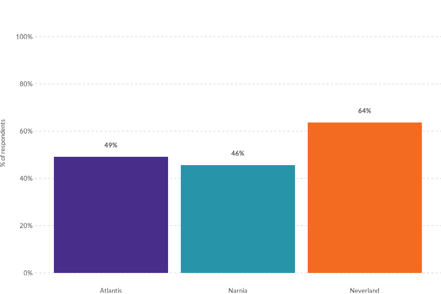
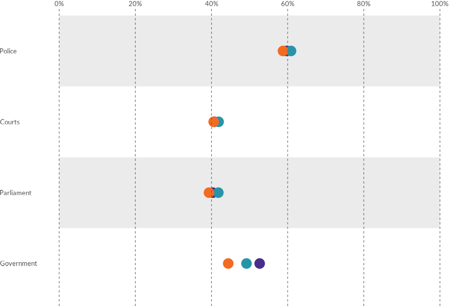
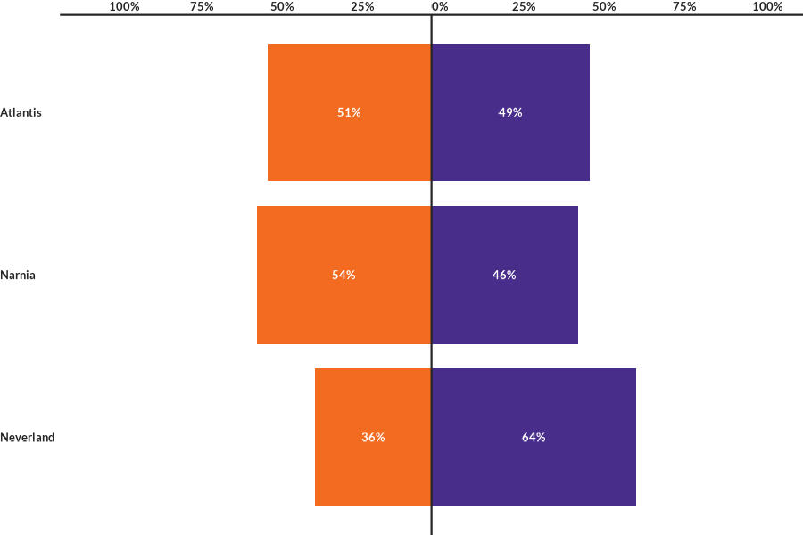
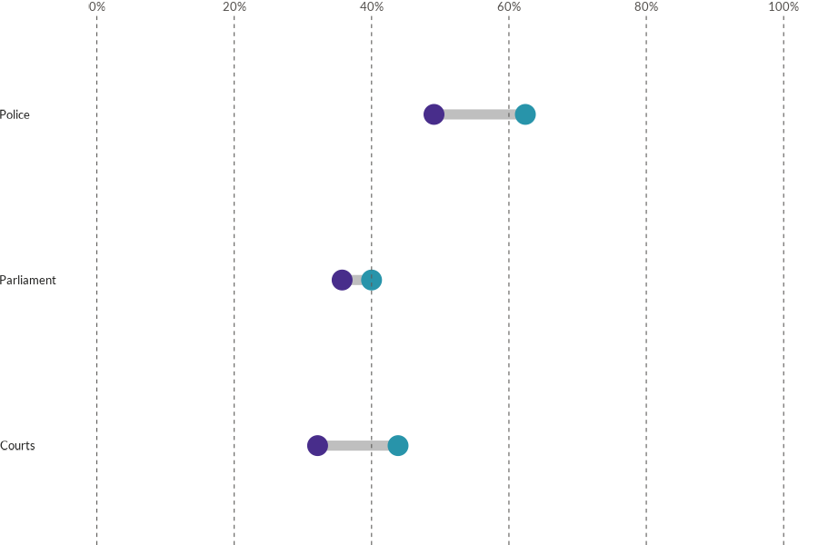
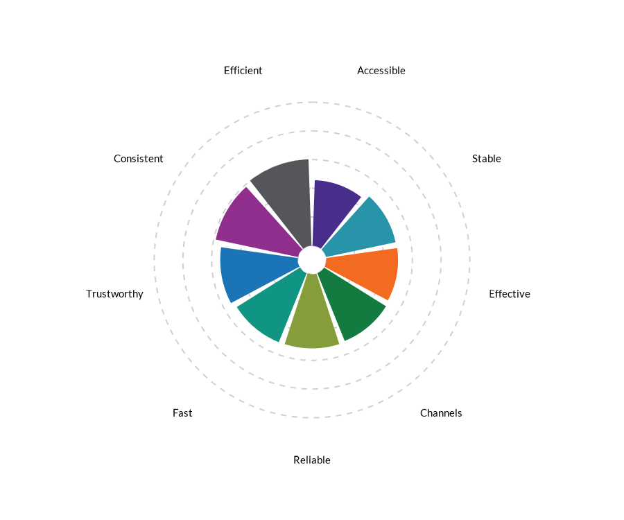
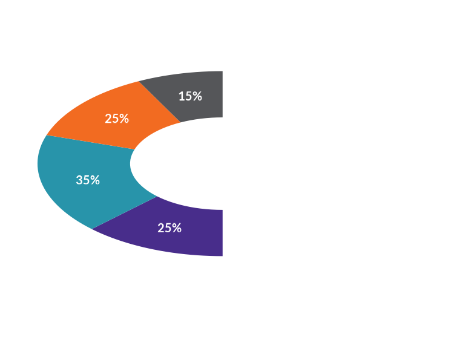
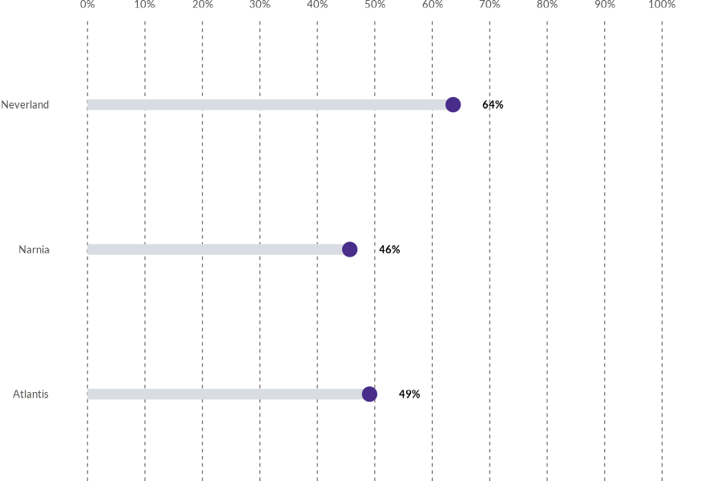
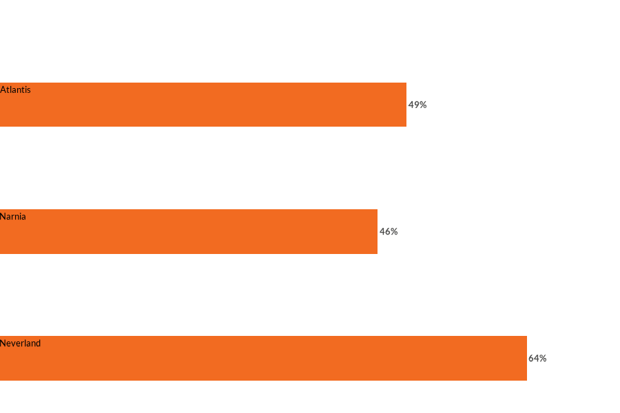
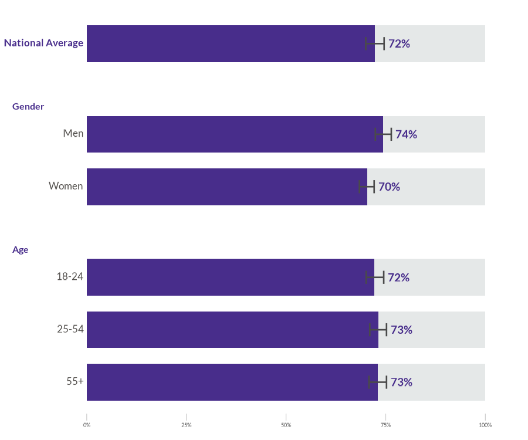

# WJPr

WJPr is an R package from the World Justice Project Data Analytics Unit for producing WJP-style graphics and working with Rule of Law Index data. It is designed for analysts who need publication-ready charts, reproducible examples, and consistent visual language across country-report and research workflows.

## Features

WJPr provides:

- Chart functions for bars, diverging bars, grouped bars, dots, lines, slopes, dumbbells, lollipops, radar, rose, and gauge visualizations.
- Built-in sample datasets for Rule of Law Index and General Population Poll workflows.
- A shared WJP theme, fonts, and color guidance for consistent report graphics.
- Validation helpers for checking chart-ready data before plotting.

## Installation

WJPr is hosted on GitHub. To install the package, ensure you have the `devtools` package installed and use the following commands:

```R
# Install WJPr from GitHub
devtools::install_github("worldjusticeproject-org/WJPr")
```

## Usage

Load the package into your R session:

```R
library(WJPr)
```

### Example: Accessing Rule of Law Index Data

The package provides built-in datasets for analysis:

```R
# View the first few rows of the dataset
head(WJPr::roli)
```

### Example: Creating a Visualization

Create a simple WJP-style bar chart:

```R
# Load WJP fonts when using the default theme
wjp_fonts()

# Loading data
gpp_data <- WJPr::gpp

# Prepare the data
data4bars <- gpp_data %>%
  select(country, year, q1a) %>%
  group_by(country, year) %>%
  mutate(
    q1a = as.double(q1a),
    trust = case_when(
      q1a <= 2  ~ 1,
      q1a <= 4  ~ 0,
      q1a == 99 ~ NA_real_
    ),
    year = as.character(year)
  ) %>%
  summarise(
    trust   = mean(trust, na.rm = TRUE),
    .groups = "keep"
  ) %>%
  mutate(
    trust = trust*100
  ) %>%
  filter(year == "2022")

# Draw the chart
wjp_bars(
    data4bars,              
    target    = "trust",        
    grouping  = "country",
    colors    = "year",
    cvec      = c("2022" = "#482d8b")
)
```

## Chart Gallery

WJPr includes focused chart functions for common WJP reporting patterns:

<div class="wjp-gallery-grid">
  <a class="wjp-gallery-card" href="reference/wjp_bars.html">
    
    <strong>Bar Chart</strong>
    <code>wjp_bars()</code>
  </a>
  <a class="wjp-gallery-card" href="reference/wjp_dots.html">
    
    <strong>Dots Chart</strong>
    <code>wjp_dots()</code>
  </a>
  <a class="wjp-gallery-card" href="reference/wjp_lines.html">
    
    <strong>Line Chart</strong>
    <code>wjp_lines()</code>
  </a>
  <a class="wjp-gallery-card" href="reference/wjp_divbars.html">
    
    <strong>Diverging Bars</strong>
    <code>wjp_divbars()</code>
  </a>
  <a class="wjp-gallery-card" href="reference/wjp_dumbbells.html">
    
    <strong>Dumbbells</strong>
    <code>wjp_dumbbells()</code>
  </a>
  <a class="wjp-gallery-card" href="reference/wjp_slope.html">
    
    <strong>Slope Chart</strong>
    <code>wjp_slope()</code>
  </a>
  <a class="wjp-gallery-card" href="reference/wjp_radar.html">
    
    <strong>Radar Chart</strong>
    <code>wjp_radar()</code>
  </a>
  <a class="wjp-gallery-card" href="reference/wjp_rose.html">
    
    <strong>Rose Chart</strong>
    <code>wjp_rose()</code>
  </a>
  <a class="wjp-gallery-card" href="reference/wjp_gauge.html">
    
    <strong>Gauge Chart</strong>
    <code>wjp_gauge()</code>
  </a>
  <a class="wjp-gallery-card" href="reference/wjp_lollipops.html">
    
    <strong>Lollipop Chart</strong>
    <code>wjp_lollipops()</code>
  </a>
  <a class="wjp-gallery-card" href="reference/wjp_edgebars.html">
    
    <strong>Edgebars</strong>
    <code>wjp_edgebars()</code>
  </a>
  <a class="wjp-gallery-card" href="reference/wjp_groupbars.html">
    
    <strong>Grouped Bars</strong>
    <code>wjp_groupbars()</code>
  </a>
</div>

For a complete interactive gallery with code examples, see the [Chart Gallery vignette](https://worldjusticeproject-org.github.io/WJPr/articles/gallery.html).

## Data Structure

All WJPr visualization functions expect data in **long (tidy) format**:

```
| grouping     | target | colors   | labels (optional) |
|--------------|--------|----------|-------------------|
| Category A   | 45.2   | Group 1  | "45%"             |
| Category B   | 32.1   | Group 1  | "32%"             |
| Category A   | 51.0   | Group 2  | "51%"             |
| Category B   | 38.5   | Group 2  | "39%"             |
```

**Key parameters used across all functions:**

| Parameter  | Description                          | Type            |
|------------|--------------------------------------|-----------------|
| `target`   | Values to plot (Y-axis)              | Numeric column  |
| `grouping` | Categories (X-axis or rows)          | Character/Factor|
| `colors`   | Variable for color grouping          | Character/Factor|
| `cvec`     | Named vector mapping values to colors| `c("A" = "#HEX")`|
| `labels`   | Text labels to display               | Character column|

### Grouped Bars

`wjp_groupbars()` compares a percentage across demographic groups in separate facets. The `target` column can be supplied as proportions (`0-1`) or percentages (`0-100`); the function plots both on a 0-100 percentage scale.

```R
groupbars <- data.frame(
  group    = c("Gender", "Gender", "Age", "Age", "Age"),
  category = c("Men", "Women", "18-24", "25-54", "55+"),
  value    = c(74.4, 70.3, 72.1, 73.1, 73.0),
  lower    = c(72.4, 68.4, 70.1, 71.0, 70.8),
  upper    = c(76.4, 72.1, 74.5, 75.2, 75.2)
)

wjp_groupbars(
  groupbars,
  target            = "value",
  grouping          = "group",
  levels            = "category",
  colors            = c("#482d8b", "#e5e8e8"),
  group_order       = c("Gender", "Age"),
  level_order       = list(
    Gender = c("Women", "Men"),
    Age    = c("55+", "25-54", "18-24")
  ),
  draw_ci           = TRUE,
  ci_lower          = "lower",
  ci_upper          = "upper",
  show_national     = TRUE,
  national_value    = 72.3,
  national_style    = "bar",
  national_label    = "National Average",
  national_ci_lower = 70.0,
  national_ci_upper = 74.6,
  show_axis         = TRUE
)
```

Confidence intervals can also be calculated by passing `sd` and `sample_size` instead of precomputed `ci_lower` and `ci_upper`. Use `national_style = "bar"` when the national value should appear as its own bar above or below the disaggregations; use `national_style = "line"` when it should be a dashed vertical reference line. The second color is the complement to 100%, so WJP examples usually use a neutral gray for that segment.

### Validate Your Data

Use `wjp_check_data()` to verify your data structure before plotting:

```R
wjp_check_data(
  data     = my_data,
  type     = "bars",
  target   = "value",
  grouping = "category",
  colors   = "group",
  cvec     = c("Group 1" = "#482d8b", "Group 2" = "#2894aa")
)
```

For detailed guidance, see the [Data Preparation vignette](https://worldjusticeproject-org.github.io/WJPr/articles/data-preparation.html).

## Documentation

Comprehensive documentation is available for all functions and datasets. Use the R help system to access it:

```R
?WJPr::wjp_lines
```

## Contributing

Contributions are welcome! Before contributing, please read our guidelines:

### Quick Start

1. Fork the repository
2. Create a feature branch: `git checkout -b feature/new-chart`
3. Follow the coding conventions in [CONTRIBUTING.md](CONTRIBUTING.md)
4. Submit a pull request

### Adding New Functions

All visualization functions must follow the WJPr patterns:

```r
wjp_newchart <- function(
    data,
    target,
    grouping,
    colors    = NULL,
    cvec      = NULL,
    labels    = NULL,
    ptheme    = WJP_theme()
) {
  # 1. Rename columns using all_of()
  # 2. Handle NULL parameters
  # 3. Create ggplot
  # 4. Apply colors if cvec provided
  # 5. Apply theme
  return(plt)
}
```

### Documentation Requirements

- Roxygen2 with `@export`, `@param`, `@return`, `@examples`
- Include `lifecycle::badge("experimental")` in description
- Add example to `data-raw/generate-examples.R`
- Update `CLAUDE.md`

### Resources

- **[CONTRIBUTING.md](CONTRIBUTING.md)** - Complete contribution guidelines
- **[Development Guide](https://worldjusticeproject-org.github.io/WJPr/articles/development-guide.html)** - Step-by-step tutorial
- **[Issues](https://github.com/worldjusticeproject-org/WJPr/issues)** - Report bugs or request features

## License

This project is licensed under the MIT License. See the `LICENSE.md` file for details.

## Acknowledgments

WJPr was developed by the Data Analytics Unit at The World Justice Project. Special thanks to the whole team for their invaluable input in creating this package.
