# Data Visualization with WJPr

This vignette demonstrates how to use the data visualization functions
included in the `WJPr` package with the sample `gpp` dataset bundled
with the package. WJPr includes functions for the following chart types:

1.  Bar (Horizontal/Vertical/Stacked)
2.  Diverging Bars
3.  Lines
4.  Slopes
5.  Dots (with error bars)
6.  Dumbbells
7.  Radar
8.  Rose
9.  Edgebars
10. Lollipops
11. Grouped Bars
12. Gauge

``` r

library(ggplot2)
library(dplyr)
library(tidyr)
library(purrr)
library(haven)
library(ggtext)
library(kableExtra)
library(WJPr)
```

``` r

# Always load the WJP fonts if not passing a custom theme to function
wjp_fonts()

# Loading data
gpp_data <- WJPr::gpp
```

## Bar Chart

### Preparing the data

To begin, we will plot a simple vertical bar chart. For the `GPP`
dataset, a common use case involves visualizing the percentage of
responses across different groups of respondents. In this example, we
will plot the percentage of respondents in each country who have “a lot”
or “some” trust in Institution A. This is calculated as the percentage
of people who answered 1 or 2 to question Q1A. The first step is to
wrangle the data accordingly:

``` r

data4bars <- gpp_data %>%
  select(country, year, q1a) %>%
  group_by(country, year) %>%
  mutate(
    q1a = as.double(unclass(q1a)),
    trust = case_when(
      q1a <= 2  ~ 1,
      q1a <= 4  ~ 0,
      q1a == 99 ~ NA_real_
    ),
    year = as.character(year)
  ) %>%
  summarise(
    trust   = mean(trust, na.rm = TRUE),
    .groups = "keep"
  ) %>%
  mutate(
    trust = trust*100
  ) %>%
  filter(year == "2022")

kbl(data4bars)
```

| country   | year |    trust |
|:----------|:-----|---------:|
| Atlantis  | 2022 | 49.09091 |
| Narnia    | 2022 | 45.65217 |
| Neverland | 2022 | 63.63636 |

### Simple vertical chart

Once the data is prepared, we can create a basic vertical bar chart
using the
[`wjp_bars()`](https://worldjusticeproject-org.github.io/WJPr/reference/wjp_bars.md)
function. You only need to specify the names of the columns that contain
the values to be plotted on the Y-axis (`target`) and the categories to
be displayed on the X-axis (`grouping`).

``` r

wjp_bars(
    data4bars,              
    target    = "trust",        
    grouping  = "country",
    colors    = "country",
    cvec      = c("Atlantis"  = "#482d8b",
                  "Narnia"    = "#2894aa",
                  "Neverland" = "#f26b21")
)
```

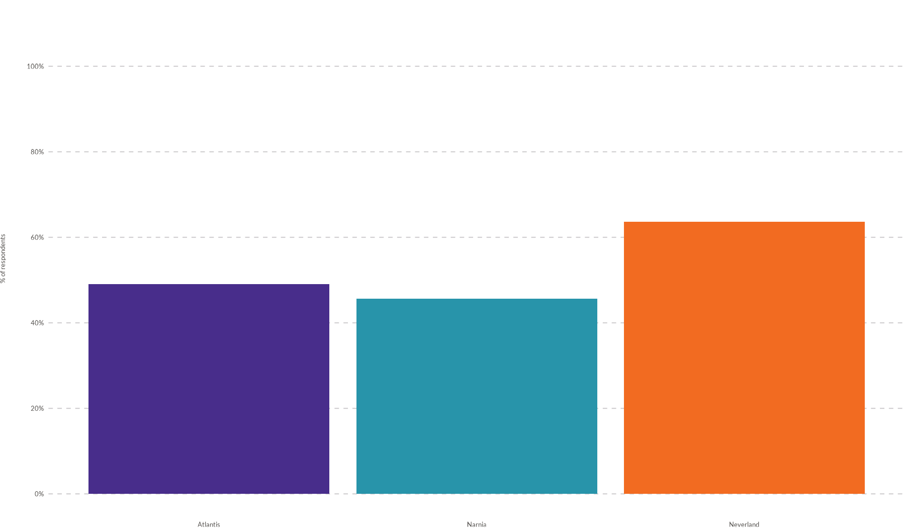

### Controlling color

Colors can be customized using the `colors` and `cvec` parameters. The
`colors` parameter specifies the column used to distinguish color
groups, while `cvec` is a named vector that maps specific values to
specific colors. For example, to give all bars a consistent primary
violet color, we can use the “year” column for `colors` and map the year
“2022” to the color code `#482d8b`.

``` r

wjp_bars(
    data4bars,              
    target    = "trust",        
    grouping  = "country",
    colors    = "year",
    cvec      = c("2022" = "#482d8b")
)
```

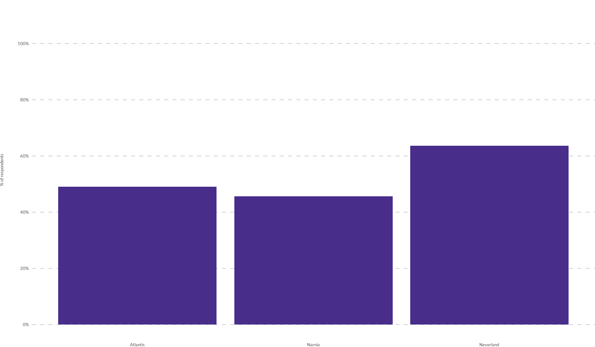

If you prefer to assign a unique color to each country, you’ll need to
create a new column because the `grouping` parameter is already using
the “country” column. In the example below, we create a new column
called “color_variable” with the same values as the “country” column:

``` r

data4bars <- data4bars %>%
  mutate(
    color_variable = country
  )

wjp_bars(
    data4bars,              
    target    = "trust",        
    grouping  = "country",
    colors    = "color_variable",
    cvec      = c("Atlantis"  = "#482d8b",
                  "Narnia"    = "#2894aa",
                  "Neverland" = "#f26b21")
)
```


### Adding value labels

To add value labels to the bars, use the `labels` and `lab_pos`
parameters. The `labels` parameter specifies the column containing the
label values, while `lab_pos` determines the position of the labels.
Since the `target` column may contain values with many decimals, it’s
common to create a separate column for rounded labels. In this example,
we create two new columns, `value_label` and `label_position`, placing
the labels 5 percentage points above the tops of the bars:

``` r

data4bars <- data4bars %>%
  mutate(
    value_label = paste0(
      format(
        round(trust, 0),
        nsmall = 0
      ),
      "%"
    ),
    label_position = trust + 5
  )

wjp_bars(
    data4bars,              
    target    = "trust",        
    grouping  = "country",
    labels    = "value_label",
    lab_pos   = "label_position",
    colors    = "color_variable",
    cvec      = c("Atlantis"  = "#482d8b",
                  "Narnia"    = "#2894aa",
                  "Neverland" = "#f26b21")
)
```

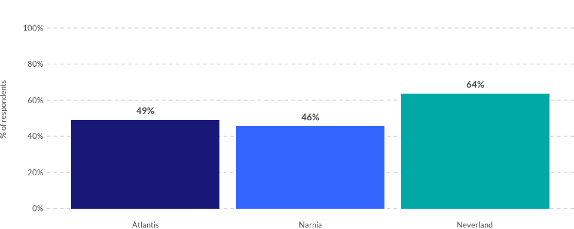

### Switch to horizontal bars

By default, the bars are plotted vertically. However, switching to
horizontal bars is as simple as setting the `direction` parameter to
“horizontal”.

``` r

wjp_bars(
    data4bars,              
    target    = "trust",        
    grouping  = "country",
    labels    = "value_label",
    lab_pos   = "label_position",
    colors    = "color_variable",
    cvec      = c("Atlantis"  = "#482d8b",
                  "Narnia"    = "#2894aa",
                  "Neverland" = "#f26b21"),
    direction = "horizontal"
)
```

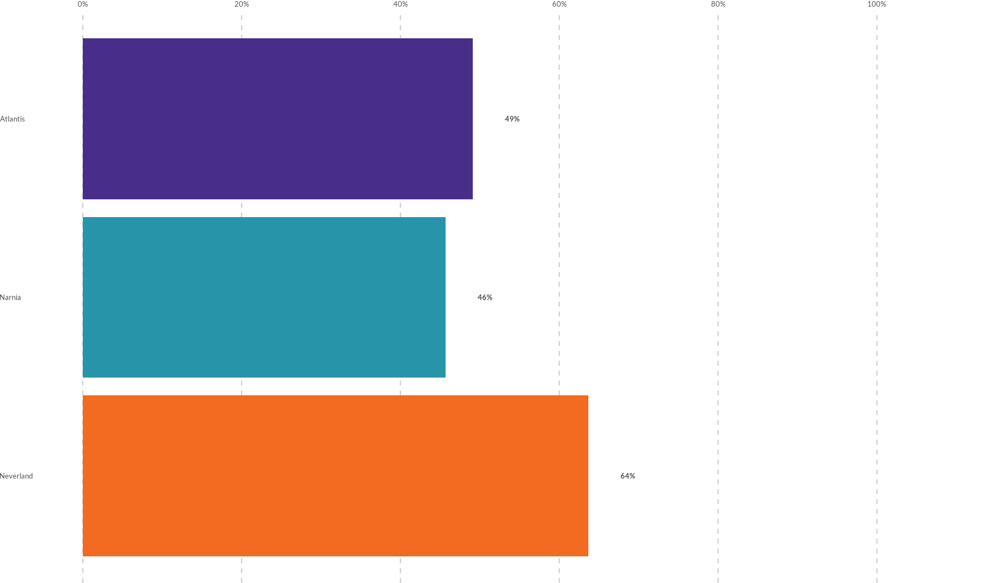

## Stacked Bars Chart

The
[`wjp_bars()`](https://worldjusticeproject-org.github.io/WJPr/reference/wjp_bars.md)
function can also be used to create stacked bar charts. For instance,
instead of plotting the percentage of respondents who have “a lot” or
“some” trust in Institution A, we can visualize the percentage
distribution for all possible responses in each country. First, we
modify the data to reflect this new design:

``` r

data4stackedbars <- gpp_data %>%
  filter(
    year == 2022
  ) %>%
  select(country, q1a) %>%
  mutate(
    q1a = as.double(unclass(q1a)),
    q1a  = case_when(
      q1a == 1  ~ "A lot",
      q1a == 2  ~ "Some",
      q1a == 3  ~ "Little",
      q1a == 4  ~ "None",
      q1a == 99 ~ "No answer",
    ),
    q1a = factor(
      q1a, 
      levels = c("A lot", "Some", "Little", "None", "No answer")
    )
  ) %>%
  group_by(country, q1a) %>%
  count() %>%
  group_by(country) %>%
  arrange(country, desc(q1a)) %>%
  mutate(
    total       = sum(n),
    percentage  = (n/total)*100,
    value_label = paste0(
      format(
        round(percentage, 1),
        nsmall = 1
      ),
      "%"
    ),
    value_label = if_else(percentage >= 5, value_label, NA_character_),
    label_position = cumsum(percentage)-(percentage/2)
  ) %>%
  select(
    country, q1a, percentage, value_label, label_position
  )

kbl(data4bars)
```

| country   | year |    trust | color_variable | value_label | label_position |
|:----------|:-----|---------:|:---------------|:------------|---------------:|
| Atlantis  | 2022 | 49.09091 | Atlantis       | 49%         |       54.09091 |
| Narnia    | 2022 | 45.65217 | Narnia         | 46%         |       50.65217 |
| Neverland | 2022 | 63.63636 | Neverland      | 64%         |       68.63636 |

Notice that we transform the q1a column into a factor variable and
define the specific levels (order) of responses. Specifying factor
levels allows us to control how the answers are displayed in the chart.
If we don’t define the factor levels, the responses will default to
alphabetical order, which may not align with the intended order of this
ordinal variable.

Once the data is ready, we can use the
[`wjp_bars()`](https://worldjusticeproject-org.github.io/WJPr/reference/wjp_bars.md)
function again, this time setting the `stacked` parameter to “TRUE”:

``` r

stacked_bar <- wjp_bars(
    data4stackedbars,              
    target    = "percentage",        
    grouping  = "country",
    labels    = "value_label",
    lab_pos   = "label_position",
    colors    = "q1a",
    cvec      = c("A lot"     = "#482d8b",
                  "Some"      = "#2894aa",
                  "Little"    = "#869d3b",
                  "None"      = "#f26b21",
                  "No answer" = "#555659"),
    direction = "horizontal",
    stacked   = TRUE
)
```

## Diverging Bars Chart

Diverging bar charts are a variation of standard bar charts that use
both the positive and negative sides of the Cartesian plane to display
information. For example, let’s revisit our earlier case where we
plotted levels of trust in Institution A. With diverging bars, we can
plot the percentage of respondents who answered “A lot” and “Some” on
one side, and the percentage of respondents who answered “Little” and
“None” on the other. To achieve this, we first need to wrangle the data
slightly differently:

``` r

data4divbars <- gpp_data %>%
  filter(
    year == 2022
  ) %>%
  select(country, q1a) %>%
  mutate(
    q1a = as.double(unclass(q1a)),
    q1a  = case_when(
      q1a <= 2  ~ "Trust",
      q1a <= 4  ~ "No Trust"
    )
  ) %>%
  group_by(country, q1a) %>%
  count() %>%
  filter(
    !is.na(q1a)
  ) %>%
  group_by(country) %>%
  mutate(
    total       = sum(n),
    percentage  = (n/total)*100,
    value_label = paste0(
      format(
        round(percentage, 1),
        nsmall = 1
      ),
      "%"
    ),
    value_label    = if_else(percentage >= 5, 
                             value_label, 
                             NA_character_),
    direction      = if_else(q1a == "Trust", 
                             "positive", 
                             "negative"),
    percentage     = if_else(direction == "negative", 
                             percentage*-1, 
                             percentage),
    label_position = (percentage/2)
  ) %>%
  select(
    country, q1a, percentage, value_label, label_position, direction
  )

kbl(data4divbars)
```

| country   | q1a      | percentage | value_label | label_position | direction |
|:----------|:---------|-----------:|:------------|---------------:|:----------|
| Atlantis  | No Trust |  -50.90909 | 50.9%       |      -25.45455 | negative  |
| Atlantis  | Trust    |   49.09091 | 49.1%       |       24.54545 | positive  |
| Narnia    | No Trust |  -54.34783 | 54.3%       |      -27.17391 | negative  |
| Narnia    | Trust    |   45.65217 | 45.7%       |       22.82609 | positive  |
| Neverland | No Trust |  -36.36364 | 36.4%       |      -18.18182 | negative  |
| Neverland | Trust    |   63.63636 | 63.6%       |       31.81818 | positive  |

Diverging bar charts are a variation of standard bar charts that use
both the positive and negative sides of the Cartesian plane to display
information. For example, let’s revisit our earlier case where we
plotted levels of trust in Institution A. With diverging bars, we can
plot the percentage of respondents who answered “A lot” and “Some” on
one side, and the percentage of respondents who answered “Little” and
“None” on the other. To achieve this, we first need to wrangle the data
slightly differently:

Pay close attention to how we create a new variable, `direction`, to
specify the direction in which the values should be plotted. Values
associated with a “negative” direction are converted into negative
numbers.

Once the data is prepared, we can use the
[`wjp_divbars()`](https://worldjusticeproject-org.github.io/WJPr/reference/wjp_divbars.md)
function to create the chart. Several parameters are used in the same
way as in the wjp_bars() function:

- `target`: Specifies the column containing the values to be plotted.
- `grouping`: Specifies the column containing the categorical groupings.
- `cvec`: Contains a named vector that links specific values to color
  codes.
- `labels`: Specifies the column containing the value labels to display
  (optional).

In addition to these familiar parameters, the
[`wjp_divbars()`](https://worldjusticeproject-org.github.io/WJPr/reference/wjp_divbars.md)
function has two unique parameters essential for diverging bar charts:

- `diverging`: Specifies the column name that identifies the direction
  of the values (positive or negative).
- `negative`: Specifies the value in the diverging column that indicates
  negative values.

By combining these parameters, the
[`wjp_divbars()`](https://worldjusticeproject-org.github.io/WJPr/reference/wjp_divbars.md)
function allows for clear and effective visualization of contrasting
groups within the data.

``` r

wjp_divbars(
    data4divbars,             
    target      = "percentage",       
    grouping    = "country",         
    diverging   = "q1a",     
    negative    = "negative",   
    cvec        = c("Trust"     = "#482d8b",
                    "No Trust"  = "#f26b21"),
    labels      = "value_label"
)
```

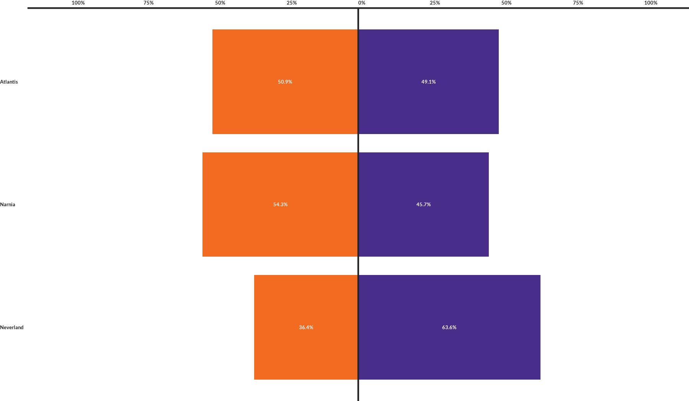

## Edgebars

Edgebars is a specific type of horizontal bars that have the Y-Axis text
on top of the bar instead that along the axis. This design modification
is a good option when the dimensions of the plot are small (narrow) and
the axis texts are expected to be long. Use the wjp_edgebars()\`
function to plot these bars in a similar way than previous examples.

``` r

wjp_edgebars(
    data4bars,              
    target    = "trust",        
    grouping  = "country",
    labels    = "color_variable",
    cvec      = "#2894aa"
)
```

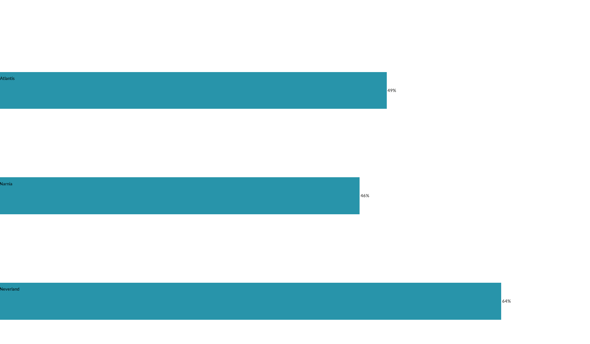

## Line Chart

Line charts are a great way to display the evolution of values over
time. The
[`wjp_lines()`](https://worldjusticeproject-org.github.io/WJPr/reference/wjp_lines.md)
function allows you to create line charts with ease. Let’s assume we
want to examine the percentage of people who have “a lot” or “some”
trust in Institution A in Atlantis over time. To begin, we need to
wrangle the data to match this design:

``` r

data4lines <- gpp_data %>%
  filter(
    country == "Atlantis"
  ) %>%
  select(year, q1a, q1b, q1c) %>%
  mutate(
    across(
      !year,
      \(x) as.double(unclass(x))
    ),
    across(
      !year,
      ~case_when(
        .x <= 2  ~ 1,
        .x <= 4  ~ 0,
        .x == 99 ~ NA_real_
      )
    ),
    year = as.character(year)
  ) %>%
  group_by(year) %>%
  summarise(
    across(
      everything(),
      \(x) mean(x, na.rm = TRUE)
    ),
    .groups = "keep"
  ) %>%
  mutate(
    across(
      everything(),
      \(x) x*100
    )
  ) %>%
  pivot_longer(
    !year,
    names_to  = "variable",
    values_to = "percentage" 
  ) %>%
  mutate(
    institution = case_when(
      variable == "q1a" ~ "Institution A",
      variable == "q1b" ~ "Institution B",
      variable == "q1c" ~ "Institution C"
    ),
    value_label = paste0(
      format(
        round(percentage, 0),
        nsmall = 0
      ),
      "%"
    )
  )

kbl(data4lines)
```

| year | variable | percentage | institution   | value_label |
|:-----|:---------|-----------:|:--------------|:------------|
| 2017 | q1a      |   62.39316 | Institution A | 62%         |
| 2017 | q1b      |   43.85965 | Institution B | 44%         |
| 2017 | q1c      |   40.00000 | Institution C | 40%         |
| 2019 | q1a      |   63.51351 | Institution A | 64%         |
| 2019 | q1b      |   42.46575 | Institution B | 42%         |
| 2019 | q1c      |   44.44444 | Institution C | 44%         |
| 2022 | q1a      |   49.09091 | Institution A | 49%         |
| 2022 | q1b      |   32.14286 | Institution B | 32%         |
| 2022 | q1c      |   35.71429 | Institution C | 36%         |

Note that we are also retaining data on trust in Institution B and
Institution C, and we are pivoting the dataset to a long format.
However, for simplicity, we will start by plotting only the percentage
of people who trust Institution A over time. We can achieve this with
the
[`wjp_lines()`](https://worldjusticeproject-org.github.io/WJPr/reference/wjp_lines.md)
function. Many of the parameters work similarly to those in other
functions:

- `target`: Specifies the column containing the values to be plotted on
  the Y-axis.
- `grouping`: Specifies the column containing the categorical groupings.
  For most line charts, this is the year or time variable.
- `colors`: Specifies the column used to distinguish different colors
  for the lines.
- `cvec`: Contains a named vector mapping specific values to their
  corresponding color codes.
- `labels`: Specifies the column containing value labels to display, if
  any.

Additionally, the
[`wjp_lines()`](https://worldjusticeproject-org.github.io/WJPr/reference/wjp_lines.md)
function requires the ngroups parameter to define the number of groups.
Here’s how to set it:

1.  For a single line: If plotting only one line, as in the example
    below, set ngroups = 1.

``` r

wjp_lines(
    data4lines %>% filter(institution == "Institution A"),                    
    target         = "percentage",             
    grouping       = "year",
    ngroups        = 1,                 
    colors         = "institution",
    cvec           = c("Institution A" = "#482d8b"),
    labels         = "value_label"
)
```

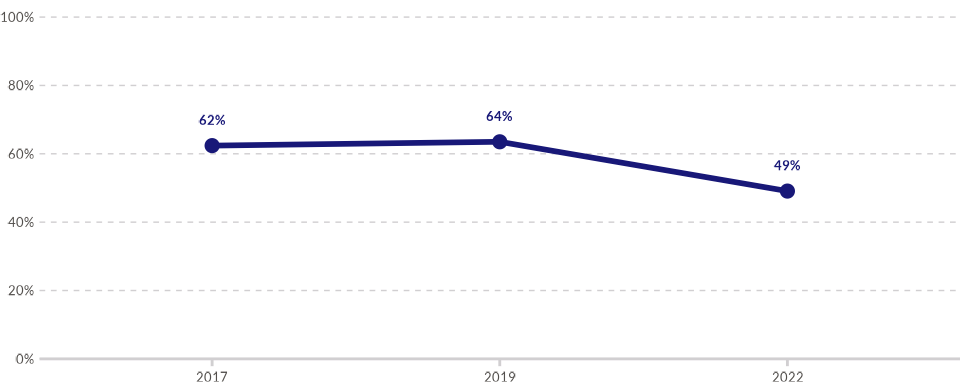

2.  For multiple lines: When plotting multiple lines, specify the column
    containing the group identifiers. In this case, also consider
    setting repel = TRUE to prevent overlapping value labels. Note that
    the ggrepel package must be loaded for this feature to work.

``` r

library(ggrepel)
wjp_lines(
    data4lines,                    
    target         = "percentage",             
    grouping       = "year",
    ngroups        = data4lines$institution,                 
    colors         = "institution",
    cvec           = c("Institution A" = "#482d8b",
                       "Institution B" = "#2894aa",
                       "Institution C" = "#f26b21"),
    labels         = "value_label",
    repel          = TRUE
)
```

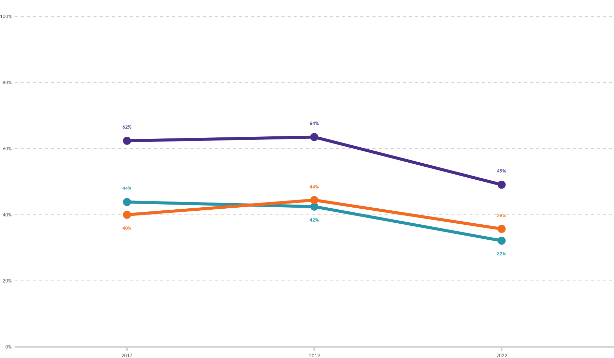

### Controlling opacities

The
[`wjp_lines()`](https://worldjusticeproject-org.github.io/WJPr/reference/wjp_lines.md)
function includes a special feature that allows you to highlight
specific lines by adjusting their opacity. For instance, if you want to
highlight the line representing trust levels in Institution A, start by
setting `transparency = TRUE`. Then, use the `transparencies` parameter
to pass a named vector specifying the opacity levels for each line.
Ensure the named vector uses the same values as the color vector
(`cvec`) to align opacities with the corresponding lines.

``` r

wjp_lines(
    data4lines,                    
    target         = "percentage",             
    grouping       = "year",
    ngroups        = data4lines$institution,                 
    colors         = "institution",
    cvec           = c("Institution A" = "#482d8b",
                       "Institution B" = "#2894aa",
                       "Institution C" = "#f26b21"),
    labels         = "value_label",
    repel          = TRUE,
    transparency   = TRUE,
    transparencies = c("Institution A" = 1.00,
                       "Institution B" = 0.25,
                       "Institution C" = 0.25)
)
```

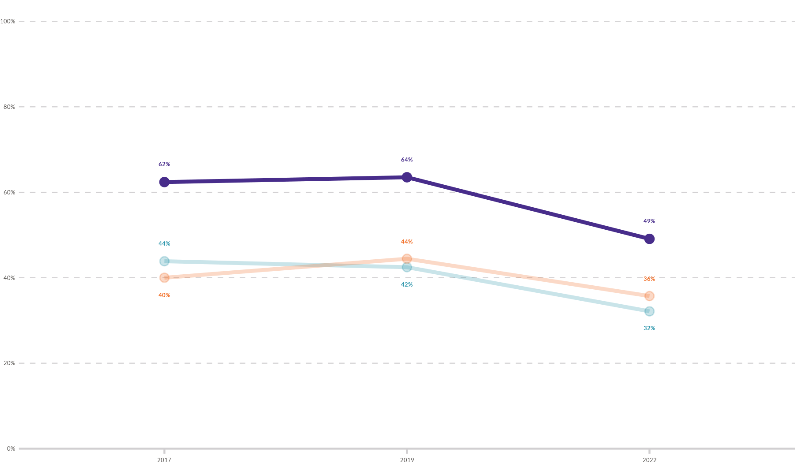

## Slope Chart

Slope charts are a great choice for visualizing the evolution of
variables between two specific points in time. They provide a more
aesthetically pleasing alternative to line charts in such cases. The
[`wjp_slope()`](https://worldjusticeproject-org.github.io/WJPr/reference/wjp_slope.md)
function is designed for this purpose.

Let’s use an example where we disaggregate the evolution of trust in
Institution A between 2017 and 2022 across three countries. We begin by
preparing the data to fit this design:

``` r

data4slopes <- gpp_data %>%
  select(year, gend, q1a) %>%
  filter(
    year %in% c(2017, 2019)
  ) %>%
  mutate(
    gend = as.double(unclass(gend)),
    q1a = as.double(unclass(q1a)),
    trust = case_when(
      q1a <= 2  ~ 1,
      q1a <= 4  ~ 0
    ),
    gender = case_when(
      gend == 1 ~ "Male",
      gend == 2 ~ "Female"
    )
  ) %>%
  group_by(year, gender) %>%
  summarise(
    trust = mean(trust, na.rm = T)*100,
    .groups = "keep"
  ) %>%
  mutate(
    value_label = paste0(
      format(
        round(trust, 0),
        nsmall = 0
      ),
      "%"
    )
  )

kbl(data4slopes)
```

| year | gender |    trust | value_label |
|-----:|:-------|---------:|:------------|
| 2017 | Female | 60.00000 | 60%         |
| 2017 | Male   | 58.59873 | 59%         |
| 2019 | Female | 65.90909 | 66%         |
| 2019 | Male   | 63.46154 | 63%         |

Once the data is ready, we can use the wjp_slope() function. This
function relies on parameters that have been covered in previous
examples:

- `target`: Specifies the column containing the values to be plotted on
  the Y-axis.
- `grouping`: Specifies the column containing the categorical groupings.
  For slope charts, this usually refers to the time variable or year.
- `colors`: Specifies the column used to distinguish different colors in
  the slope chart.
- `cvec`: Contains a named vector mapping specific values to their
  corresponding color codes.
- `labels`: Specifies the column containing value labels to display, if
  any.
- `ngroups`: Defines the number of lines to be plotted. For a single
  line, set `ngroups = 1`. For multiple lines, pass the column
  containing the group identifiers.
- `repel`: Activates the `ggrepel` feature to prevent overlapping
  labels. Note that the `ggrepel` package must be loaded for this
  feature to work.

Using these parameters, you can create a slope chart that effectively
highlights changes between two points in time while maintaining clarity
and visual appeal.

``` r

wjp_slope(
    data4slopes,                    
    target    = "trust",             
    grouping  = "year",
    ngroups   = data4slopes$gender,                 
    labels    = "value_label",
    colors    = "gender",
    cvec      = c("Male"   = "#482d8b",
                  "Female" = "#f26b21"),
    repel     = TRUE
)
```

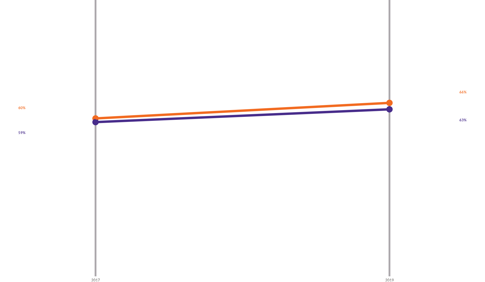

## Dots Chart

### Minimal Example

Dot charts are an excellent option for displaying multiple variables and
comparing results across different agents, regions, or categories. The
[`wjp_dots()`](https://worldjusticeproject-org.github.io/WJPr/reference/wjp_dots.md)
function allows you to create dot charts efficiently and effectively.

Let’s walk through an example where we plot the percentage of people who
have “a lot” or “some” trust in Institutions A, B, C, and D across three
countries: Atlantis, Narnia, and Neverland. To start, we need to prepare
our data for this minimal example as follows:

``` r

data4dots <- gpp_data %>%
  select(country, q1a, q1b, q1c, q1d) %>%
  mutate(
    across(!country, \(x) as.double(unclass(x))),
    across(
      !country,
      \(x) case_when(
        x <= 2 ~ 1,
        x <= 4 ~ 0
      )
    )
  ) %>%
  group_by(country) %>%
  summarise(
    across(
      everything(),
      \(x) mean(x, na.rm = T)*100
    ),
    .groups = "keep"
  ) %>%
  pivot_longer(
    !country,
    names_to  = "variable",
    values_to = "percentage" 
  ) %>%
  mutate(
    institution = case_when(
      variable == "q1a" ~ "Institution A",
      variable == "q1b" ~ "Institution B",
      variable == "q1c" ~ "Institution C",
      variable == "q1d" ~ "Institution D",
    )
  )
kbl(data4dots)
```

| country   | variable | percentage | institution   |
|:----------|:---------|-----------:|:--------------|
| Atlantis  | q1a      |   59.75610 | Institution A |
| Atlantis  | q1b      |   40.74074 | Institution B |
| Atlantis  | q1c      |   40.33613 | Institution C |
| Atlantis  | q1d      |   52.65306 | Institution D |
| Narnia    | q1a      |   60.88710 | Institution A |
| Narnia    | q1b      |   41.86992 | Institution B |
| Narnia    | q1c      |   41.80328 | Institution C |
| Narnia    | q1d      |   49.20000 | Institution D |
| Neverland | q1a      |   58.77551 | Institution A |
| Neverland | q1b      |   40.57377 | Institution B |
| Neverland | q1c      |   39.34426 | Institution C |
| Neverland | q1d      |   44.39834 | Institution D |

Once the data is prepared, we can use the
[`wjp_dots()`](https://worldjusticeproject-org.github.io/WJPr/reference/wjp_dots.md)
function to create the dot chart. The required parameters for this
function are consistent with those explained in earlier sections:

- `target`: The column name containing the values to be plotted as dots.
- `grouping`: The column name containing the categorical groupings
  (e.g., institutions or categories being compared).
- `colors`: The column name used to assign different colors to the dots.
- `cvec`: A named vector linking specific values to their corresponding
  color codes.

``` r

wjp_dots(
    data4dots,             
    target      = "percentage",
    grouping    = "institution",  
    colors      = "country",  
    cvec        = c("Atlantis"  = "#482d8b",
                    "Narnia"    = "#2894aa",
                    "Neverland" = "#f26b21")
)
```

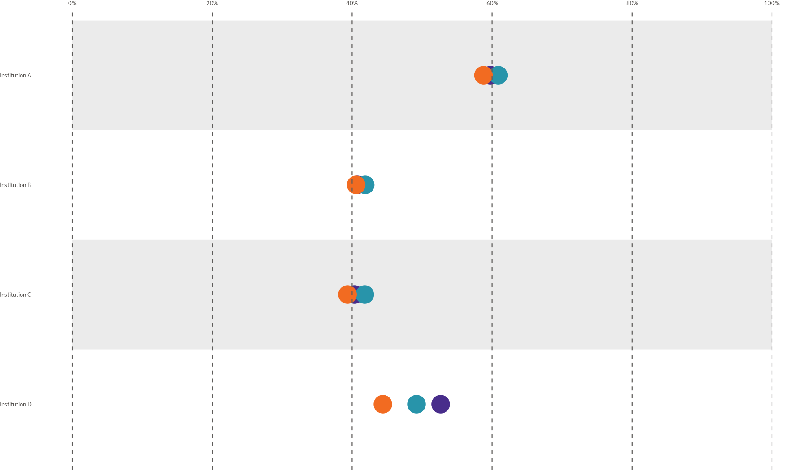

### Controlling opacities and shapes

A special feature of the
[`wjp_dots()`](https://worldjusticeproject-org.github.io/WJPr/reference/wjp_dots.md)
is that it allows you to apply a special highlight to certain data
points through the manipulation of shapes and opacities. For this, we
begin by setting the `diffOpac` and the `diffShp` parameters to TRUE.
Then, we proceed to pass a named vector with the specific values of
opacities and the desired symbol codes. The control of these traits
works on the same values passed as through the `colors` and `cvec`
parameters. To check the symbol codes used in ggplot, you can read the
[ggplot2
documentation](https://ggplot2.tidyverse.org/articles/ggplot2-specs.html#sec:shape-spec).

``` r

wjp_dots(
    data4dots,             
    target      = "percentage",
    grouping    = "institution",  
    colors      = "country",  
    cvec        = c("Atlantis"  = "#482d8b",
                    "Narnia"    = "#2894aa",
                    "Neverland" = "#f26b21"),
    diffOpac    = TRUE,
    opacities   = c("Atlantis"  = 0.3,
                    "Narnia"    = 1.0,
                    "Neverland" = 0.3),
    diffShp     = TRUE,     
    shapes      = c("Atlantis"  = 15,
                    "Narnia"    = 21,
                    "Neverland" = 15)
)
```

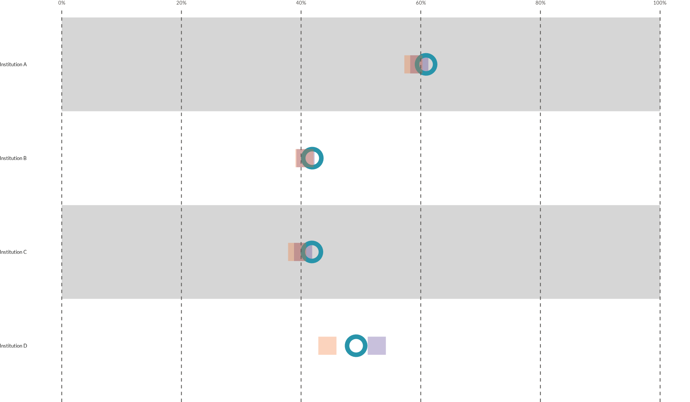

### Adding confidence intervals

The
[`wjp_dots()`](https://worldjusticeproject-org.github.io/WJPr/reference/wjp_dots.md)
function has a special feature that allows us to add confidence
intervals to the plotted data points. This comes very handy when we want
to visualize if two data points are statistically different from each
other. Let’s assume that we want to know if the trust levels in
Institution A, B, C, and D, are statistically different between males
and females in our sample. For this, we first need to plot our data a
little bit different given that, besides the data point (mean), we will
also require the standard deviation and the sample size for each group
and variable.

``` r

data4dots_errorbars <- gpp_data %>%
  select(gend, q1a, q1b, q1c, q1d) %>%
  mutate(
    across(everything(), \(x) as.double(unclass(x))),
    gend = case_when(
      gend == 1 ~ "Male",
      gend == 2 ~ "Female",
    ),
    across(
      !gend,
      \(x) case_when(
        x <= 2 ~ 1,
        x <= 4 ~ 0
      )
    )
  ) %>%
  group_by(gend) %>%
  summarise(
    across(
      c(q1a, q1b, q1c, q1d),
      \(x) mean(x, na.rm = T)*100,
      .names = "{col}_mean"
    ),
    across(
      c(q1a, q1b, q1c, q1d),
      \(x) sum(!is.na(x)),
      .names = "{col}_n"
    ),
    across(
      c(q1a, q1b, q1c, q1d),
      \(x) sd(x, na.rm = T)*100,
      .names = "{col}_sd"
    ),
    .groups = "keep"
  ) %>%
  pivot_longer(
    !gend,
    names_to      = c("variable", "stat"), 
    names_pattern = "(.*)_(.*)",
    values_to     = "value"
  ) %>%
  pivot_wider(
    names_from  = "stat",
    values_from = "value"
  ) %>%
  mutate(
    institution = case_when(
      variable == "q1a" ~ "Institution A",
      variable == "q1b" ~ "Institution B",
      variable == "q1c" ~ "Institution C",
      variable == "q1d" ~ "Institution D",
    )
  )

kbl(data4dots_errorbars)
```

| gend   | variable |     mean |   n |       sd | institution   |
|:-------|:---------|---------:|----:|---------:|:--------------|
| Female | q1a      | 59.90099 | 404 | 49.07067 | Institution A |
| Female | q1b      | 40.60150 | 399 | 49.17039 | Institution B |
| Female | q1c      | 43.35840 | 399 | 49.61915 | Institution C |
| Female | q1d      | 50.86849 | 403 | 50.05460 | Institution D |
| Male   | q1a      | 59.70149 | 335 | 49.12315 | Institution A |
| Male   | q1b      | 41.61677 | 334 | 49.36616 | Institution B |
| Male   | q1c      | 37.00306 | 327 | 48.35525 | Institution C |
| Male   | q1d      | 46.24625 | 333 | 49.93393 | Institution D |

Once that we have the data ready. We make use of the
[`wjp_dots()`](https://worldjusticeproject-org.github.io/WJPr/reference/wjp_dots.md)
function and we set `draw_ci = TRUE` inside the function call.
Additionally, we also need to specify the `sd` and `sample_size`
parameters, which are the column names that contain the standard
deviation and the sample size for each variable and group.

``` r

wjp_dots(
    data4dots_errorbars,             
    target      = "mean",
    grouping    = "institution",  
    colors      = "gend",  
    cvec        = c("Male"   = "#482d8b",
                    "Female" = "#f26b21"),
    draw_ci     = TRUE,
    sd          = "sd",
    sample_size = "n"
)
```

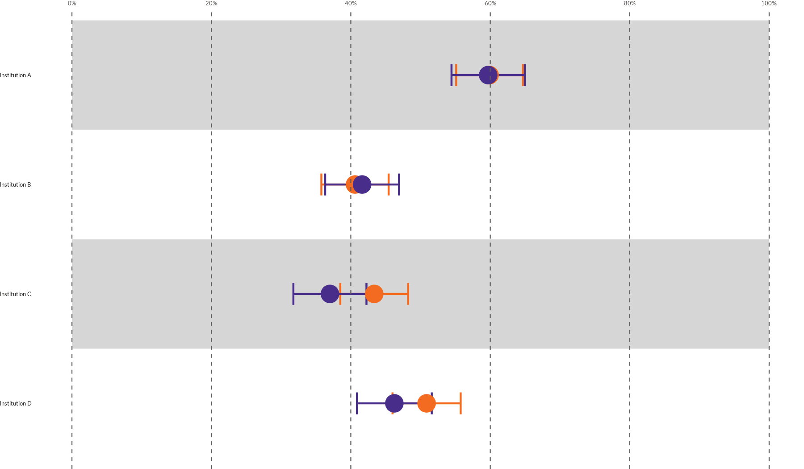

## Dumbbells

Dumbbells are a good option when we want to focus on two different
points in time for multiple variables. The `wjp_dumbbells` function is
used to plot dumbbells for this purpose. We can use the data that we
used for plotting our line chart above and just filtering for two points
in time. Once we have the data we can apply the
[`wjp_dumbbells()`](https://worldjusticeproject-org.github.io/WJPr/reference/wjp_dumbbells.md)
function as usual with the parameters that we have reviewed in previous
sections:

``` r

data4dumbbells <- data4lines %>% 
  filter(year %in% c("2017", "2022")) 

wjp_dumbbells(
    data = data4dumbbells,
    target    = "percentage",
    grouping  = "institution",
    color     = "year",
    cvec      = c("2017" = "#2894aa",
                  "2022" = "#482d8b"),
    cgroups   = c("2017", "2022")
)
```

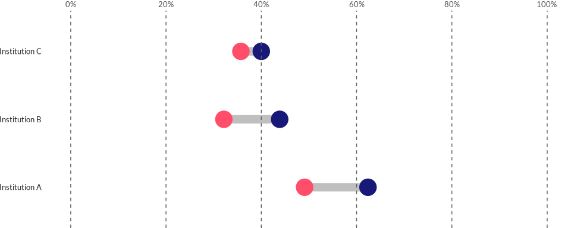

Adding value labels to a dumbbell chart is as easy as specifying the
column names that have the value label (`labels`) and the label position
(`labpos`) to the plotting function.

``` r

data4dumbbells <- data4dumbbells %>% 
  mutate(
    lab_position = if_else(year == "2022", percentage-5, percentage+5)
  )

wjp_dumbbells(
    data = data4dumbbells,
    target    = "percentage",
    grouping  = "institution",
    color     = "year",
    cgroups   = c("2017", "2022"),
    cvec      = c("2017" = "#2894aa",
                  "2022" = "#482d8b"),
    labels    = "value_label",
    labpos    = "lab_position"
)
```

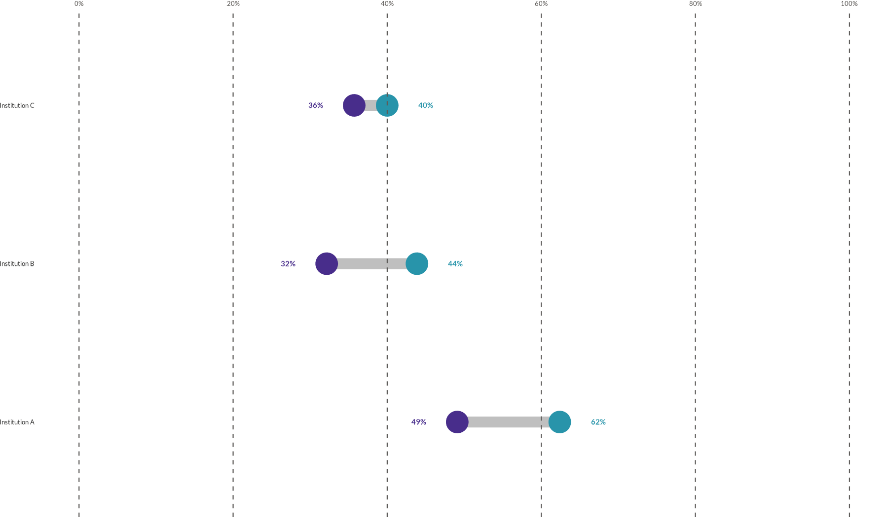

## Radar Chart

### Minimal example

An alternative when trying to compare data points in multiple dimensions
across groups is to use a radar chart. The
[`wjp_radar()`](https://worldjusticeproject-org.github.io/WJPr/reference/wjp_radar.md)
function can help you to quickly display a radar chart given a specific
set of variables. Let’s assume that we want to plot the data points for
a given set of variables that measure the performance of the justice
system and we want to see disaggregated results per gender. We begin by
wrangling the data accordingly:

``` r

data4radar <- gpp_data %>%
  select(gend, starts_with("q49")) %>%
  mutate(
    gend = as.double(unclass(gend)),
    across(starts_with("q49"), \(x) as.double(unclass(x))),
    gender = case_when(
      gend == 1 ~ "Male",
      gend == 2 ~ "Female"
    ),
    across(
      starts_with("q49"),
      \(x) case_when(
        x <= 2  ~ 1,
        x <= 99 ~ 0
      )
    )
  ) %>%
  group_by(gender) %>%
  summarise(
    across(
      starts_with("q49"),
      \(x) mean(x, na.rm = T)*100
    )
  ) %>%
  pivot_longer(
    !gender,
    names_to  = "category",
    values_to = "percentage"
  ) %>%
  mutate(
    axis_label = category
  )

kbl(data4radar)
```

| gender | category | percentage | axis_label |
|:-------|:---------|-----------:|:-----------|
| Female | q49a     |   51.57480 | q49a       |
| Female | q49b_G1  |   42.33577 | q49b_G1    |
| Female | q49b_G2  |   48.36601 | q49b_G2    |
| Female | q49c_G1  |   48.90511 | q49c_G1    |
| Female | q49c_G2  |   48.36601 | q49c_G2    |
| Female | q49d_G1  |   48.00000 | q49d_G1    |
| Female | q49d_G2  |   45.32374 | q49d_G2    |
| Female | q49e_G1  |   41.30435 | q49e_G1    |
| Female | q49e_G2  |   46.40523 | q49e_G2    |
| Male   | q49a     |   51.64319 | q49a       |
| Male   | q49b_G1  |   45.66929 | q49b_G1    |
| Male   | q49b_G2  |   50.86207 | q49b_G2    |
| Male   | q49c_G1  |   58.59375 | q49c_G1    |
| Male   | q49c_G2  |   49.57265 | q49c_G2    |
| Male   | q49d_G1  |   60.20408 | q49d_G1    |
| Male   | q49d_G2  |   51.81818 | q49d_G2    |
| Male   | q49e_G1  |   50.00000 | q49e_G1    |
| Male   | q49e_G2  |   53.98230 | q49e_G2    |

Once that we have the data ready, we can proceed by applying the
[`wjp_radar()`](https://worldjusticeproject-org.github.io/WJPr/reference/wjp_radar.md)
function. Several parameters are used in the same way as in the previous
functions:

- `target`: Specifies the column containing the values to be plotted.
- `axis_var`: Equivalent to what is called `grouping` in other
  functions. It specifies the column containing the categorical
  groupings or variables that will be shown in each axis of the polar
  chart.
- `color_var`: The column name used to assign different data points to
  different lines. Each line will have a different color.
- `cvec`: Contains a named vector that links specific values to color
  codes.
- `label_var`: Specifies the column containing the value labels to
  display.

``` r

wjp_radar(
    data4radar,             
    axis_var    = "category",         
    target      = "percentage",       
    labels      = "axis_label",        
    colors      = "gender"
)
```

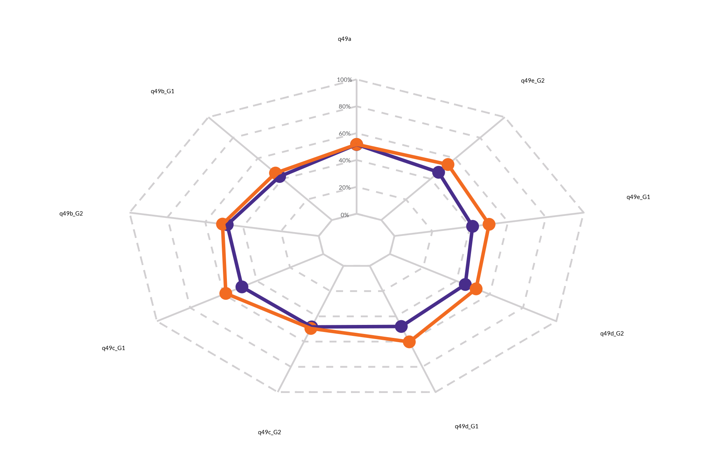

### Markdown support

One unique feature of the
[`wjp_radar()`](https://worldjusticeproject-org.github.io/WJPr/reference/wjp_radar.md)
function is its ability to support markdown and HTML aesthetics for the
axis labels. Let’s assume that we want to extend the previous plot by
displaying some explanatory text along with the specific value labels
for both lines we can do this by creating a new column called
“axis_label” that will have bolded text using markdown syntax as well as
the value labels displayed using some HTML and CSS styles:

``` r

data4radar_md <- data4radar %>%
  group_by(category) %>%
  mutate(
    axis_label = case_when(
      category == "q49a"    ~ "**System is reliable**",
      category == "q49e_G2" ~ "**System is trustworthy**",
      category == "q49e_G1" ~ "**System is effective**",
      category == "q49d_G2" ~ "**System is fast**",
      category == "q49d_G1" ~ "**System is efficient**",
      category == "q49c_G2" ~ "**System is stable**",
      category == "q49c_G1" ~ "**System has no breaks**",
      category == "q49b_G2" ~ "**System has plenty of<br>channels**",
      category == "q49b_G1" ~ "**System has no loopholes**"
    ),
    
    male_value   = percentage,
    male_value   = if_else(gender == "Male", male_value, NA_real_),
    male_value   = first(male_value, na_rm = T),
    male_value   = paste0(format(round(male_value, 0), nsmall=0), "%"),
    
    female_value = percentage,
    female_value = if_else(gender == "Female", female_value, NA_real_),
    female_value = first(female_value, na_rm = T),
    female_value   = paste0(format(round(female_value, 0), nsmall=0), "%"),
    
    axis_label_md = paste0(
      "<span style='color:#482d8b;font-size:4.217518mm'>",male_value,"</span>",
      "<span style='color:#555659;font-size:4.217518mm'> | </span>",
      "<span style='color:#f26b21;font-size:4.217518mm'>",female_value,"</span><br>",
      "<span style='color:#555659;font-size:3.514598mm;font-weight:bold'>",axis_label,"</span>"
    )
  )

wjp_radar(
    data        = data4radar_md,
    axis_var    = "category",
    target      = "percentage",
    labels      = "axis_label_md",
    colors      = "gender",
    cvec        = c("Male"   = "#482d8b",
                    "Female" = "#f26b21")
)
```

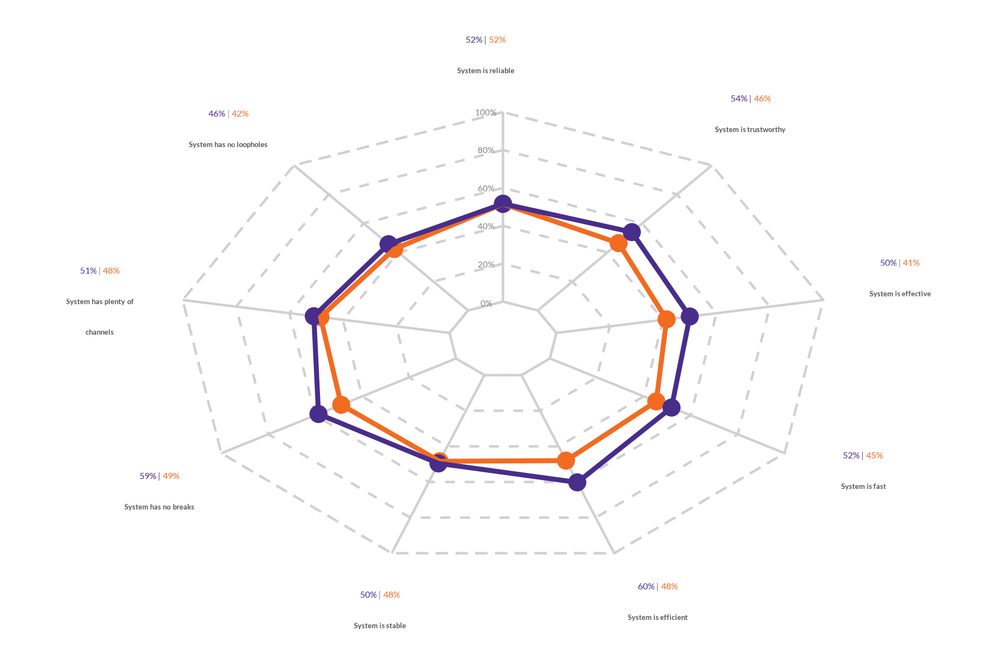

## Rose Chart

A radar chart is an excellent option to display data points across
multiple variables for a single unit or for a disaggregated overview
within an unit. However, an alternative to display multiple data points
for a single unit would be a rose chart, which also uses polar
coordinates. For this, the user can make use of the
[`wjp_rose()`](https://worldjusticeproject-org.github.io/WJPr/reference/wjp_rose.md)
function. All the parameters used by
[`wjp_rose()`](https://worldjusticeproject-org.github.io/WJPr/reference/wjp_rose.md)
are used in the same way as in the previous functions:

- `target`: Specifies the column containing the values to be plotted.
- `grouping`: It specifies the column containing the categorical
  groupings or variables that will be shown in each axis of the polar
  chart.
- `cvec`: Contains a named vector that links specific values to color
  codes.
- `labels`: Specifies the column containing the axis labels to display.

We can recreate the use of this plotting function using the same data
used to exemplify the radar chart.

``` r

data4rose = data4radar %>% 
  filter(gender == "Female")

wjp_rose(
    data4rose,
    target    = "percentage",
    grouping  = "category",
    labels    = "axis_label",
    cvec      = c("#482d8b", "#2894aa", "#f26b21",
                  "#137b3f", "#869d3b", "#0f9581",
                  "#1a74b6", "#8f2e8c", "#555659")
)
```

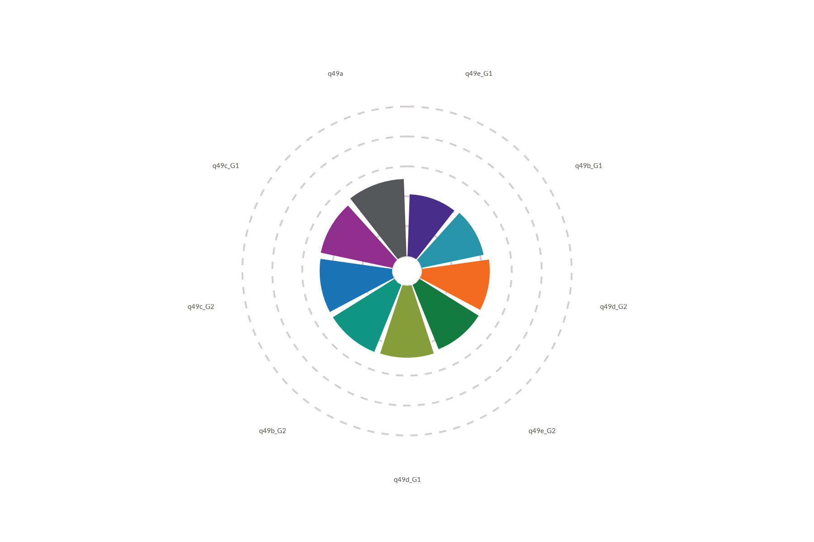

## Controlling the order of elements

Sometimes, we might want to control the order in which we show some
elements in our charts. Some of the plotting functions in our WJPr
package include the a `custom_order` and an `order` parameter. Let’s say
that we want to further customize the diverging bars that we showed
above and present the bars following in a specific order: Neverland (1),
Atlantis (2), and Narnia (3). For this, we begin by setting the
`custom_order` to TRUE and adding a new column to our data that has the
specific order of the elements:

``` r

data4divbars <- data4divbars %>%
  mutate(
    order_no = case_when(
      country == "Neverland" ~ 1,
      country == "Atlantis"  ~ 2,
      country == "Narnia"    ~ 3
    )
  )

wjp_divbars(
    data4divbars,             
    target       = "percentage",       
    grouping     = "country",         
    diverging    = "q1a",     
    negative     = "negative",   
    cvec         = c("Trust"     = "#482d8b",
                     "No Trust"  = "#f26b21"),
    labels       = "value_label",
    custom_order = TRUE,
    order        = "order_no" 
)
```

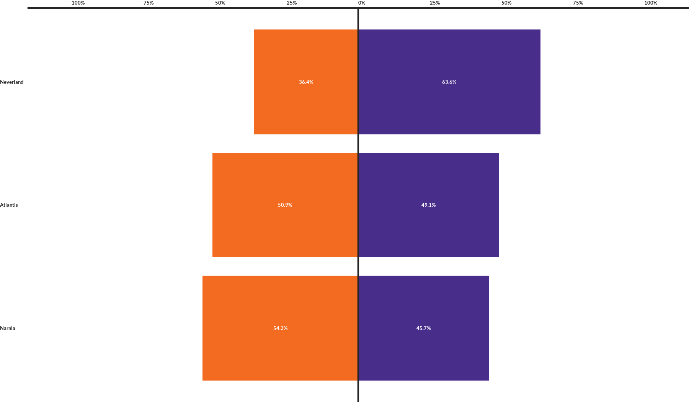

Same can be done when working with dot charts:

``` r

data4dots <- data4dots %>%
  mutate(
    order_no = case_when(
      variable == "q1c" ~ 1,
      variable == "q1b" ~ 2,
      variable == "q1d" ~ 3,
      variable == "q1a" ~ 4
    )
  )

wjp_dots(
    data4dots,             
    target      = "percentage",
    grouping    = "institution",  
    colors      = "country",  
    cvec        = c("Atlantis"  = "#482d8b",
                    "Narnia"    = "#2894aa",
                    "Neverland" = "#f26b21"),
    order       = "order_no"
)
```

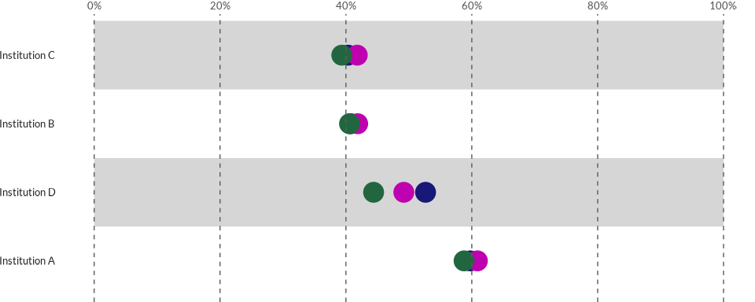

## Adding more customizations

All the plotting functions from the WJPr package return a ggplot object.
This means that, with a further knowledge of ggplot, the user can
further customize the plot returned by the plotting function. For
example, let’s say that we want to further customize our stacked bars
from before and completely remove the panel grid and add some title and
subtitle to it. We can do it by using the
[`labs()`](https://ggplot2.tidyverse.org/reference/labs.html) and
[`theme()`](https://ggplot2.tidyverse.org/reference/theme.html)
functions from the ggplot2 package as shown bellow:

``` r

stacked_bar +
  labs(
    title    = "Trust in Institution A",
    subtitle = "Percentage of people who has a lot, some, little, or no trust in Institution A"
  ) +
  theme(
    axis.text.x         = element_blank(),
    panel.grid.major.x  = element_blank(),
    plot.title.position = "plot",
    plot.subtitle       = element_text(face = "italic")
  ) 
```

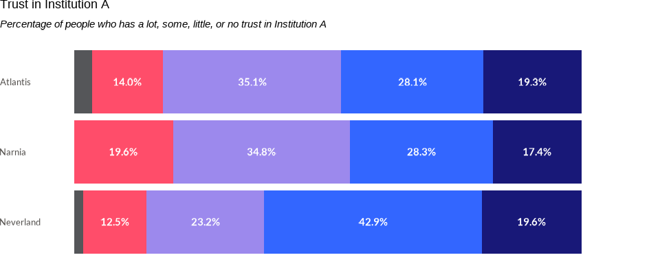
