# Chart Gallery

This gallery showcases the chart types available in WJPr using a
consistent World Justice Project visual language: Lato typography, clear
percentage labels, high-contrast text, restrained grid lines, and WJP
brand colors. The examples use the package’s sample data and are
intended to demonstrate chart structure, not to reproduce findings from
a specific report.

``` r

library(ggplot2)
library(dplyr)
library(tidyr)
library(WJPr)

# Always load the WJP fonts before plotting
wjp_fonts()
```

## WJP Color Palette

The WJPr package uses colors from the WJP brand system:

| Color Name | Hex Code | Usage |
|----|----|----|
| Violet (Primary) | `#482d8b` | Main series, section headers, emphasis |
| Teal-Blue | `#2894aa` | Secondary series and comparison groups |
| Orange | `#f26b21` | Contrast, warnings, negative or divergent values |
| Cool Gray | `#555659` | Body text, axes, notes, and supporting elements |

For categorical data visualizations, start with violet, teal-blue, and
orange. When a chart needs more categories, use the established Rule of
Law Index factor colors already included in this package. The full
ordered palette is available programmatically via
[`wjp_palette()`](https://worldjusticeproject-org.github.io/WJPr/reference/wjp_palette.md):

``` r

wjp_palette()
#> [1] "#482d8b" "#2894aa" "#f26b21" "#137b3f" "#869d3b" "#0f9581" "#1a74b6"
#> [8] "#8f2e8c" "#555659"
```

Every chart function falls back to this palette automatically when you
do not supply a color vector (`cvec`), so quick exploratory charts stay
on-brand by default.

## Typography

[`wjp_fonts()`](https://worldjusticeproject-org.github.io/WJPr/reference/wjp_fonts.md)
registers two font systems from Google Fonts: **Lato** (Full, Light, and
Black weights) and **Inter Tight**. All charts use Lato by default. To
switch every chart of the session — axis text, value labels, and legends
— set the `wjpr.family` option once:

``` r

# Check the active family
wjp_font_family()
#> [1] "Lato Full"

# Same chart, Inter Tight
options(wjpr.family = "Inter Tight")

wjp_bars(
  data.frame(
    country = c("Atlantis", "Narnia", "Neverland"),
    trust   = c(49, 46, 64)
  ) %>%
    mutate(label = paste0(trust, "%"), label_pos = trust + 6),
  target   = "trust",
  grouping = "country",
  labels   = "label",
  lab_pos  = "label_pos"
)
```

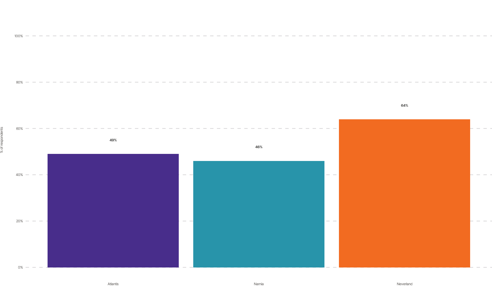

``` r


# Back to Lato (the default)
options(wjpr.family = NULL)
```

For a single chart, wrap the call with
`withr::with_options(list(wjpr.family = "Inter Tight"), ...)`. To change
only the theme elements (axis text and titles) of one chart, pass
`ptheme = WJP_theme(family = "Inter Tight")` — note that value labels
keep the session font in that case. See
[`wjp_font_family()`](https://worldjusticeproject-org.github.io/WJPr/reference/wjp_font_family.md)
for details.

``` r

# Load sample data
gpp_data <- WJPr::gpp

# WJP Color Palettes
wjp_categorical <- c(
  "#482d8b", "#2894aa", "#f26b21", "#137b3f", "#869d3b",
  "#0f9581", "#1a74b6", "#8f2e8c", "#555659"
)

# Colors for contrasting two groups
wjp_contrast <- c("#482d8b", "#f26b21")

# Factor colors (Rule of Law Index)
wjp_factors <- c(
  "Constraints" = "#137b3f",
  "Corruption"  = "#869d3b",
  "Open Gov"    = "#0f9581",
  "Rights"      = "#1a74b6",
  "Security"    = "#413179",
  "Regulatory"  = "#8f2e8c",
  "Civil"       = "#89191c",
  "Criminal"    = "#f07623"
)
```

------------------------------------------------------------------------

## Bar Charts

### Vertical Bars

[`wjp_bars()`](https://worldjusticeproject-org.github.io/WJPr/reference/wjp_bars.md) -
Standard vertical bar chart for comparing values across categories.

``` r

data_bars <- gpp_data %>%
  filter(year == 2022) %>%
  mutate(
    q1a  = as.double(unclass(q1a)),
    trust = case_when(q1a <= 2 ~ 1, q1a <= 4 ~ 0)
  ) %>%
  group_by(country) %>%
  summarise(trust = mean(trust, na.rm = TRUE) * 100, .groups = "drop") %>%
  mutate(label = paste0(round(trust, 0), "%"), label_pos = trust + 5)

wjp_bars(
  data_bars,
  target   = "trust",
  grouping = "country",
  colors   = "country",
  labels   = "label",
  lab_pos  = "label_pos",
  cvec     = c("Atlantis" = "#482d8b", "Narnia" = "#2894aa", "Neverland" = "#f26b21")
)
```

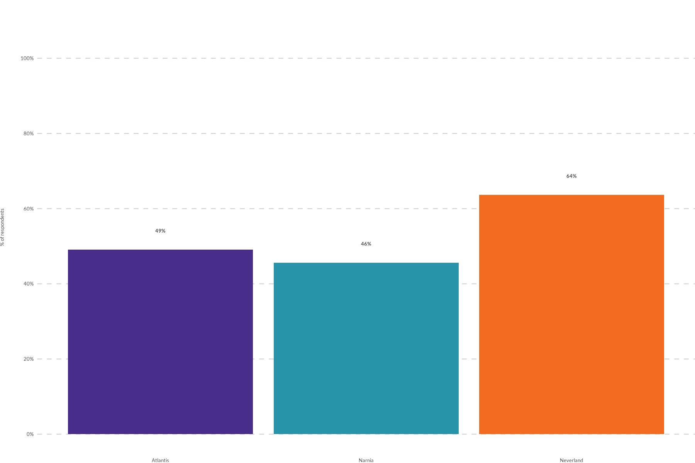

**Expected input structure** — one row per category, with the value
column (`target`) and the category column (`grouping`);
`labels`/`lab_pos` are optional helpers for the data labels.

For stacked or multi-series bars, set `show_legend = TRUE` when `colors`
identifies the segments or series. A legend is intentionally omitted for
simple category bars like this example because it would repeat the axis
labels.

| country   |    trust | label | label_pos |
|:----------|---------:|:------|----------:|
| Atlantis  | 49.09091 | 49%   |  54.09091 |
| Narnia    | 45.65217 | 46%   |  50.65217 |
| Neverland | 63.63636 | 64%   |  68.63636 |

Input data for wjp_bars(): target = trust, grouping = country {.table}

### Horizontal Bars

Set `direction = "horizontal"` for horizontal orientation.

``` r

wjp_bars(
  data_bars,
  target    = "trust",
  grouping  = "country",
  colors    = "country",
  labels    = "label",
  lab_pos   = "label_pos",
  cvec      = c("Atlantis" = "#482d8b", "Narnia" = "#2894aa", "Neverland" = "#f26b21"),
  direction = "horizontal"
)
```

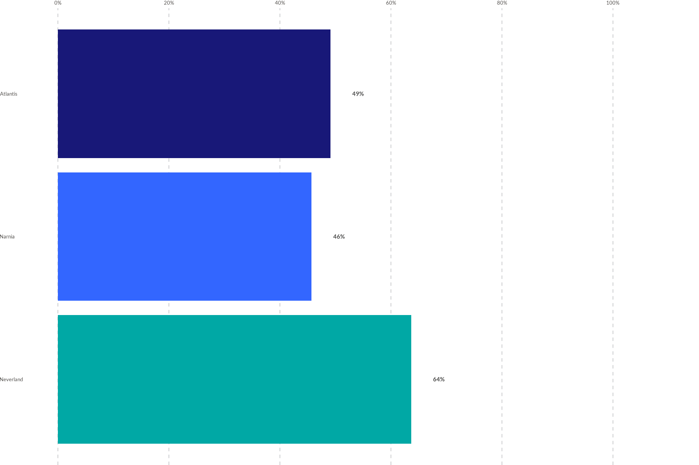

Uses the same `data_bars` structure shown above — only
`direction = "horizontal"` changes.

------------------------------------------------------------------------

## Diverging Bars

[`wjp_divbars()`](https://worldjusticeproject-org.github.io/WJPr/reference/wjp_divbars.md) -
Show positive and negative values extending from a center point.

``` r

data_divbars <- gpp_data %>%
  filter(year == 2022) %>%
  mutate(
    q1a     = as.double(unclass(q1a)),
    response = case_when(q1a <= 2 ~ "Trust", q1a <= 4 ~ "No Trust")
  ) %>%
  filter(!is.na(response)) %>%
  group_by(country, response) %>%
  count() %>%
  group_by(country) %>%
  mutate(
    percent = (n / sum(n)) * 100,
    label   = paste0(round(percent, 0), "%")
  )

wjp_divbars(
  data_divbars,
  target    = "percent",
  grouping  = "country",
  diverging = "response",
  negative  = "No Trust",
  labels    = "label",
  cvec      = c("Trust" = "#482d8b", "No Trust" = "#f26b21"),
  show_legend = TRUE
)
```

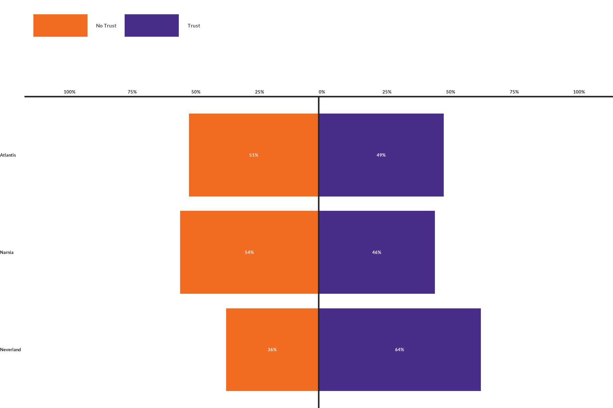

**Expected input structure** — one row per `grouping` × `diverging`
combination. The group named in `negative` is flipped into the negative
quadrant automatically, so all values can be supplied as positive
percentages. With `show_legend = TRUE`, the legend identifies the
response groups using the names in `cvec`.

| country  | response |   n |  percent | label |
|:---------|:---------|----:|---------:|:------|
| Atlantis | No Trust |  28 | 50.90909 | 51%   |
| Atlantis | Trust    |  27 | 49.09091 | 49%   |
| Narnia   | No Trust |  25 | 54.34783 | 54%   |
| Narnia   | Trust    |  21 | 45.65217 | 46%   |

Input data for wjp_divbars(): target = percent, grouping = country,
diverging = response {.table}

------------------------------------------------------------------------

## Dots Chart

[`wjp_dots()`](https://worldjusticeproject-org.github.io/WJPr/reference/wjp_dots.md) -
Compare multiple variables across groups with dot markers.

``` r

data_dots <- gpp_data %>%
  select(country, q1a, q1b, q1c, q1d) %>%
  mutate(
    across(starts_with("q1"), \(x) as.double(unclass(x))),
    across(starts_with("q1"), ~ case_when(.x <= 2 ~ 1, .x <= 4 ~ 0))
  ) %>%
  group_by(country) %>%
  summarise(across(everything(), ~ mean(.x, na.rm = TRUE) * 100), .groups = "drop") %>%
  pivot_longer(-country, names_to = "variable", values_to = "trust") %>%
  mutate(
    institution = case_when(
      variable == "q1a" ~ "Police",
      variable == "q1b" ~ "Courts",
      variable == "q1c" ~ "Parliament",
      variable == "q1d" ~ "Government"
    )
  )

wjp_dots(
  data_dots,
  target   = "trust",
  grouping = "institution",
  colors   = "country",
  cvec     = c("Atlantis" = "#482d8b", "Narnia" = "#2894aa", "Neverland" = "#f26b21"),
  show_legend = TRUE
)
```

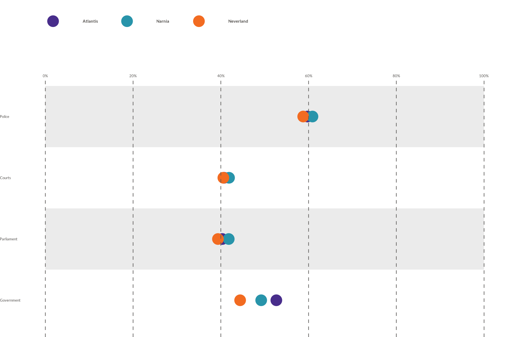

**Expected input structure** — long format: one row per `grouping`
(variable) × `colors` (group) combination, each with its `target` value.
Set `show_legend = TRUE` to identify the groups mapped through `colors`.

| country  | variable |    trust | institution |
|:---------|:---------|---------:|:------------|
| Atlantis | q1a      | 59.75610 | Police      |
| Atlantis | q1b      | 40.74074 | Courts      |
| Atlantis | q1c      | 40.33613 | Parliament  |
| Atlantis | q1d      | 52.65306 | Government  |

Input data for wjp_dots(): target = trust, grouping = institution,
colors = country {.table}

------------------------------------------------------------------------

## Line Chart

[`wjp_lines()`](https://worldjusticeproject-org.github.io/WJPr/reference/wjp_lines.md) -
Display trends over time with connected points.

``` r

library(ggrepel)

data_lines <- gpp_data %>%
  filter(country == "Atlantis") %>%
  select(year, q1a, q1b, q1c) %>%
  mutate(
    across(starts_with("q1"), \(x) as.double(unclass(x))),
    across(starts_with("q1"), ~ case_when(.x <= 2 ~ 1, .x <= 4 ~ 0)),
    year = as.character(year)
  ) %>%
  group_by(year) %>%
  summarise(across(everything(), ~ mean(.x, na.rm = TRUE) * 100), .groups = "drop") %>%
  pivot_longer(-year, names_to = "variable", values_to = "trust") %>%
  mutate(
    institution = case_when(
      variable == "q1a" ~ "Police",
      variable == "q1b" ~ "Courts",
      variable == "q1c" ~ "Parliament"
    ),
    label = paste0(round(trust, 0), "%")
  )

wjp_lines(
  data_lines,
  target   = "trust",
  grouping = "year",
  colors   = "institution",
  labels   = "label",
  repel    = TRUE,
  cvec     = c("Police" = "#482d8b", "Courts" = "#2894aa", "Parliament" = "#f26b21"),
  show_legend = TRUE
)
```

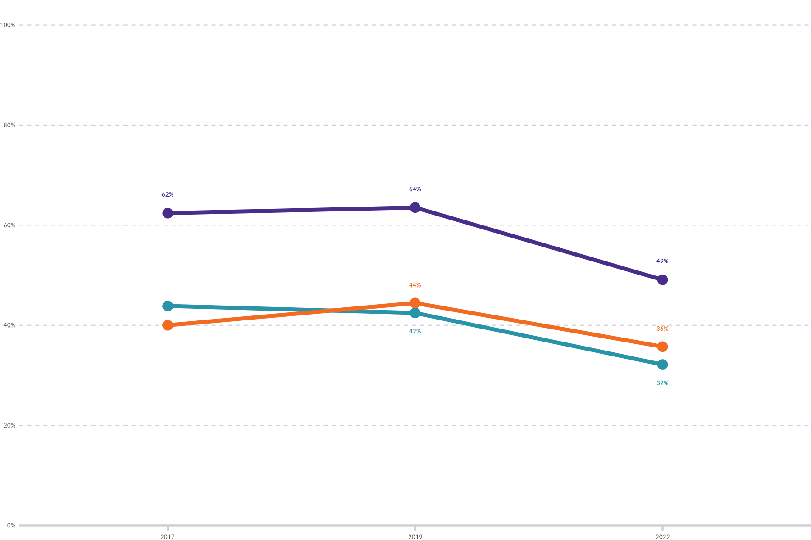

**Expected input structure** — long format: one row per `grouping` (time
point) × series. The `colors` variable defines the lines, so single- and
multi-series data use the same call. Use `show_legend = TRUE` to label
those series with a shared legend.

| year | variable |    trust | institution | label |
|:-----|:---------|---------:|:------------|:------|
| 2017 | q1a      | 62.39316 | Police      | 62%   |
| 2017 | q1b      | 43.85965 | Courts      | 44%   |
| 2017 | q1c      | 40.00000 | Parliament  | 40%   |
| 2019 | q1a      | 63.51351 | Police      | 64%   |

Input data for wjp_lines(): target = trust, grouping = year, colors =
institution {.table}

------------------------------------------------------------------------

## Slope Chart

[`wjp_slope()`](https://worldjusticeproject-org.github.io/WJPr/reference/wjp_slope.md) -
Compare values between exactly two time points.

``` r

data_slope <- gpp_data %>%
  filter(year %in% c(2017, 2019)) %>%
  mutate(
    q1a   = as.double(unclass(q1a)),
    gend  = as.double(unclass(gend)),
    trust  = case_when(q1a <= 2 ~ 1, q1a <= 4 ~ 0),
    gender = case_when(gend == 1 ~ "Male", gend == 2 ~ "Female")
  ) %>%
  group_by(year, gender) %>%
  summarise(trust = mean(trust, na.rm = TRUE) * 100, .groups = "drop") %>%
  mutate(label = paste0(round(trust, 0), "%"))

wjp_slope(
  data_slope,
  target   = "trust",
  grouping = "year",
  colors   = "gender",
  labels   = "label",
  cvec     = c("Male" = "#482d8b", "Female" = "#f26b21"),
  repel    = TRUE,
  show_legend = TRUE
)
```

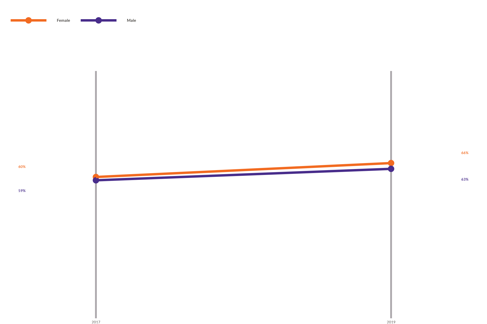

**Expected input structure** — exactly two `grouping` values (the two
time points) per series. The `colors` variable defines the lines, and
`show_legend = TRUE` identifies them above the chart.

| year | gender |    trust | label |
|-----:|:-------|---------:|:------|
| 2017 | Female | 60.00000 | 60%   |
| 2017 | Male   | 58.59873 | 59%   |
| 2019 | Female | 65.90909 | 66%   |
| 2019 | Male   | 63.46154 | 63%   |

Input data for wjp_slope(): target = trust, grouping = year, colors =
gender {.table}

------------------------------------------------------------------------

## Dumbbell Chart

[`wjp_dumbbells()`](https://worldjusticeproject-org.github.io/WJPr/reference/wjp_dumbbells.md) -
Show change between two points with connected markers.

``` r

data_dumbbells <- data_lines %>%
  filter(year %in% c("2017", "2022"))

wjp_dumbbells(
  data_dumbbells,
  target   = "trust",
  grouping = "institution",
  colors   = "year",
  cgroups  = c("2017", "2022"),
  labels   = "label",
  cvec     = c("2017" = "#2894aa", "2022" = "#482d8b"),
  show_legend = TRUE,
  label_offset = 4
)
```

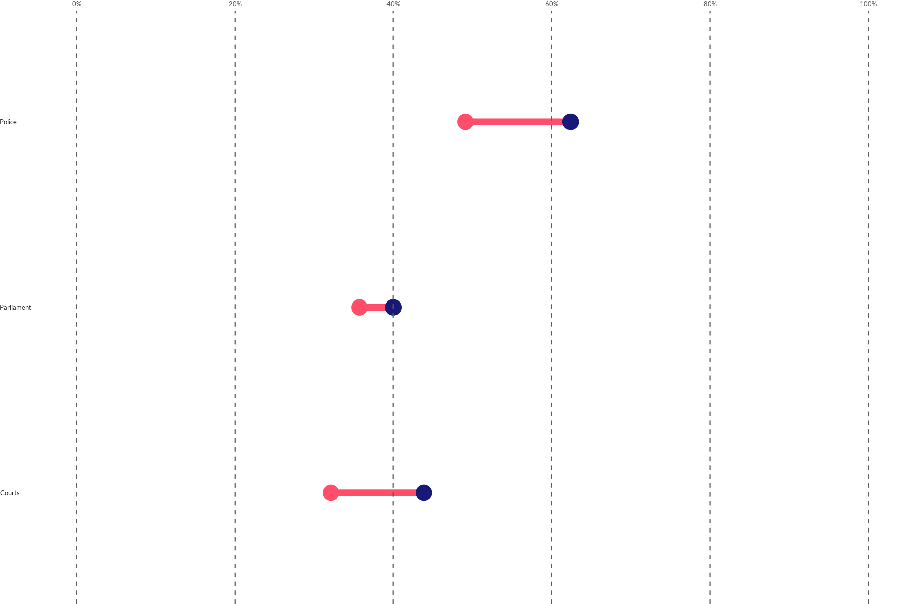

**Expected input structure** — one row per `grouping` × `colors` (the
two endpoints). `cgroups` lists the two endpoint values and supplies the
legend labels. The optional `labels` column adds a color-matched value
label next to each point; `label_offset` controls its distance from the
endpoint.

| year | variable |    trust | institution | label |
|:-----|:---------|---------:|:------------|:------|
| 2017 | q1a      | 62.39316 | Police      | 62%   |
| 2017 | q1b      | 43.85965 | Courts      | 44%   |
| 2017 | q1c      | 40.00000 | Parliament  | 40%   |
| 2022 | q1a      | 49.09091 | Police      | 49%   |

Input data for wjp_dumbbells(): target = trust, grouping = institution,
colors = year {.table}

------------------------------------------------------------------------

## Lollipop Chart

[`wjp_lollipops()`](https://worldjusticeproject-org.github.io/WJPr/reference/wjp_lollipops.md) -
Minimalist bar alternative with stems and dots.

``` r

wjp_lollipops(
  data_bars,
  target   = "trust",
  grouping = "country"
)
```

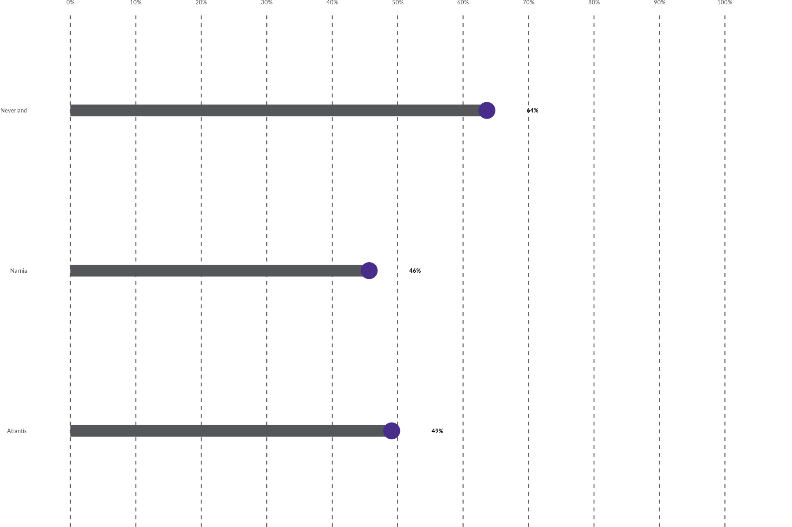

Uses the same `data_bars` structure (one row per category with a
`target` value) shown under **Bar Charts**. Value labels are generated
automatically; pass a `labels` column to override them.

------------------------------------------------------------------------

## Edgebars Chart

[`wjp_edgebars()`](https://worldjusticeproject-org.github.io/WJPr/reference/wjp_edgebars.md) -
Horizontal bars with labels at the edge, ideal for narrow spaces.

``` r

wjp_edgebars(
  data_bars,
  target   = "trust",
  grouping = "country",
  cvec     = "#2894aa"
)
```

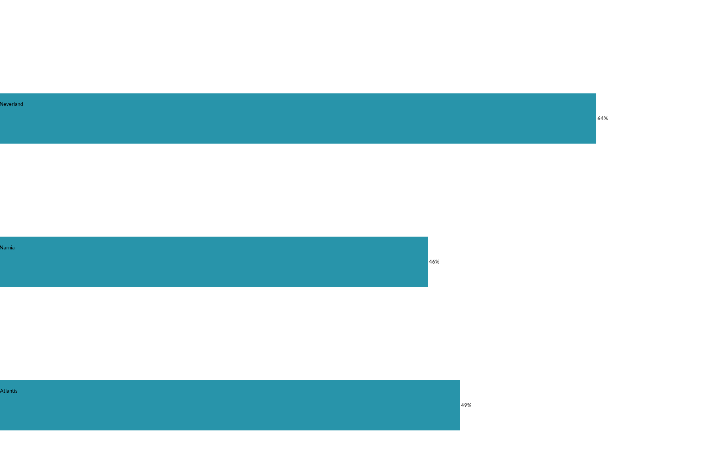

Uses the same `data_bars` structure shown under **Bar Charts**. The text
drawn at the edge of each bar defaults to the `grouping` values; pass a
`labels` column to customize it.

------------------------------------------------------------------------

## Radar Chart

[`wjp_radar()`](https://worldjusticeproject-org.github.io/WJPr/reference/wjp_radar.md) -
Compare multiple dimensions on a circular grid.

``` r

data_radar <- gpp_data %>%
  select(gend, starts_with("q49")) %>%
  mutate(
    gend = as.double(unclass(gend)),
    across(starts_with("q49"), \(x) as.double(unclass(x))),
    gender = case_when(gend == 1 ~ "Male", gend == 2 ~ "Female"),
    across(starts_with("q49"), ~ case_when(.x <= 2 ~ 1, .x <= 99 ~ 0))
  ) %>%
  group_by(gender) %>%
  summarise(across(starts_with("q49"), ~ mean(.x, na.rm = TRUE) * 100), .groups = "drop") %>%
  pivot_longer(-gender, names_to = "category", values_to = "score") %>%
  mutate(
    label = case_when(
      category == "q49a"    ~ "Reliable",
      category == "q49b_G1" ~ "Accessible",
      category == "q49b_G2" ~ "Channels",
      category == "q49c_G1" ~ "Consistent",
      category == "q49c_G2" ~ "Stable",
      category == "q49d_G1" ~ "Efficient",
      category == "q49d_G2" ~ "Fast",
      category == "q49e_G1" ~ "Effective",
      category == "q49e_G2" ~ "Trustworthy"
    )
  )

wjp_radar(
  data_radar,
  axis_var = "category",
  target   = "score",
  labels   = "label",
  colors   = "gender",
  cvec     = c("Male" = "#482d8b", "Female" = "#f26b21"),
  show_legend = TRUE
)
```

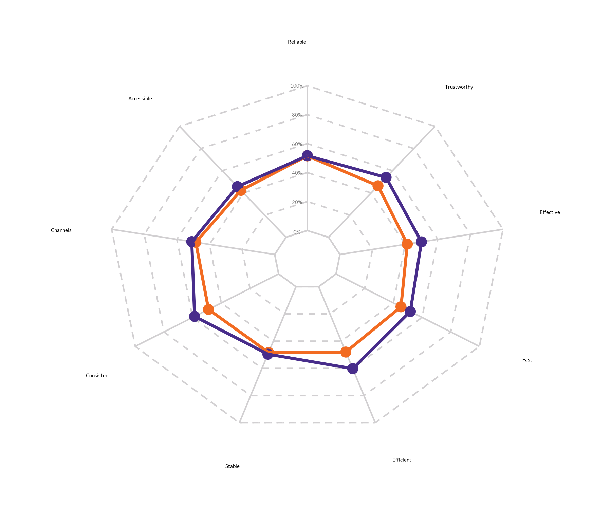

**Expected input structure** — long format: one row per `axis_var`
(dimension) × `colors` (group). `labels` gives the human-readable axis
name, while `show_legend = TRUE` identifies the compared groups.

| gender | category |    score | label      |
|:-------|:---------|---------:|:-----------|
| Female | q49a     | 51.57480 | Reliable   |
| Female | q49b_G1  | 42.33577 | Accessible |
| Female | q49b_G2  | 48.36601 | Channels   |
| Female | q49c_G1  | 48.90511 | Consistent |

Input data for wjp_radar(): target = score, axis_var = category, colors
= gender {.table}

------------------------------------------------------------------------

## Rose Chart

[`wjp_rose()`](https://worldjusticeproject-org.github.io/WJPr/reference/wjp_rose.md) -
Circular bar chart for single-unit multi-dimensional data.

``` r

data_rose <- data_radar %>%
  filter(gender == "Male")

wjp_rose(
  data_rose,
  target   = "score",
  grouping = "category",
  labels   = "label",
  cvec     = c("#482d8b", "#2894aa", "#f26b21", "#137b3f", "#869d3b",
               "#0f9581", "#1a74b6", "#8f2e8c", "#555659")
)
```

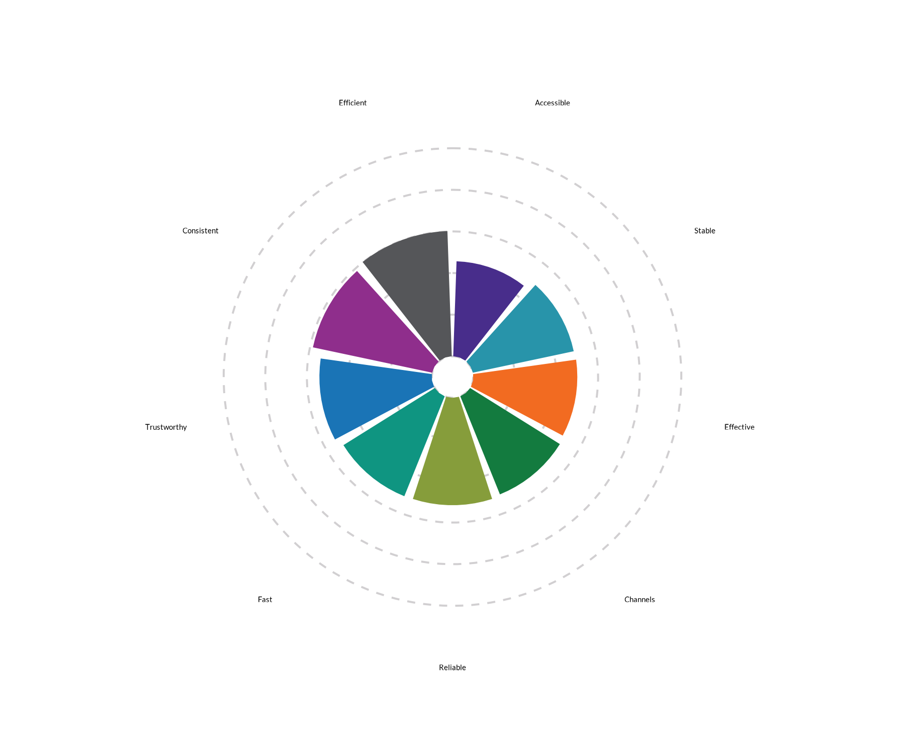

**Expected input structure** — a single unit: one row per `grouping`
(dimension) with its `target` value and a display `label`.

| gender | category |    score | label      |
|:-------|:---------|---------:|:-----------|
| Male   | q49a     | 51.64319 | Reliable   |
| Male   | q49b_G1  | 45.66929 | Accessible |
| Male   | q49b_G2  | 50.86207 | Channels   |
| Male   | q49c_G1  | 58.59375 | Consistent |

Input data for wjp_rose(): target = score, grouping = category {.table}

------------------------------------------------------------------------

## Gauge Chart

[`wjp_gauge()`](https://worldjusticeproject-org.github.io/WJPr/reference/wjp_gauge.md) -
Semicircular chart for showing composition or progress.

``` r

data_gauge <- data.frame(
  category = c("Factor 1", "Factor 2", "Factor 3", "Factor 4"),
  value    = c(25, 35, 25, 15),
  label    = c("25%", "35%", "25%", "15%")
)

wjp_gauge(
  data_gauge,
  target       = "value",
  colors       = "category",
  cvec         = c("Factor 1" = "#482d8b", "Factor 2" = "#2894aa",
                   "Factor 3" = "#f26b21", "Factor 4" = "#555659"),
  factor_order = c("Factor 1", "Factor 2", "Factor 3", "Factor 4"),
  labels       = "label",
  show_legend  = TRUE
)
```

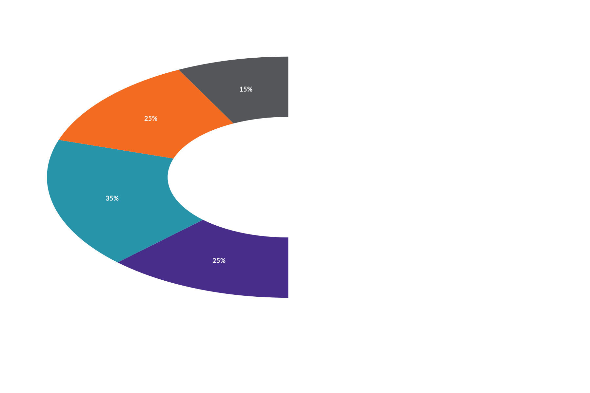

**Expected input structure** — one row per slice: a `colors` category,
its `target` value, and a display `label`. `factor_order` controls the
drawing order, and `show_legend = TRUE` identifies each colored slice.

| category | value | label |
|:---------|------:|:------|
| Factor 1 |    25 | 25%   |
| Factor 2 |    35 | 35%   |
| Factor 3 |    25 | 25%   |
| Factor 4 |    15 | 15%   |

Input data for wjp_gauge(): target = value, colors = category {.table}

------------------------------------------------------------------------

## Grouped Bars

[`wjp_groupbars()`](https://worldjusticeproject-org.github.io/WJPr/reference/wjp_groupbars.md) -
Faceted bars that compare a value across demographic groups (one facet
per `grouping`). Values can be supplied as proportions (`0-1`) or
percentages (`0-100`). Confidence intervals can be calculated from `sd`
and `sample_size`, or supplied directly with `ci_lower` and `ci_upper`.
A national/general value can be added either as its own bar
(`national_style = "bar"`) or as a vertical reference line
(`national_style = "line"`).

``` r

# Percentage-scale input with precomputed confidence intervals.
data_groupbars <- data.frame(
  group    = c("Gender", "Gender", "Age", "Age", "Age"),
  category = c("Men", "Women", "18-24", "25-54", "55+"),
  value    = c(74.4, 70.3, 72.1, 73.1, 73.0),
  lower    = c(72.4, 68.4, 70.1, 71.0, 70.8),
  upper    = c(76.4, 72.1, 74.5, 75.2, 75.2)
)

wjp_groupbars(
  data_groupbars,
  target            = "value",
  grouping          = "group",
  levels            = "category",
  colors            = c("#482d8b", "#e5e8e8"),
  group_order       = c("Gender", "Age"),
  level_order       = list(
    Gender = c("Men", "Women"),
    Age    = c("18-24", "25-54", "55+")
  ),
  draw_ci           = TRUE,
  ci_lower          = "lower",
  ci_upper          = "upper",
  show_national     = TRUE,
  national_value    = 72.3,
  national_style    = "bar",
  national_label    = "National Average",
  national_ci_lower = 70.0,
  national_ci_upper = 74.6,
  show_axis         = TRUE
)
```

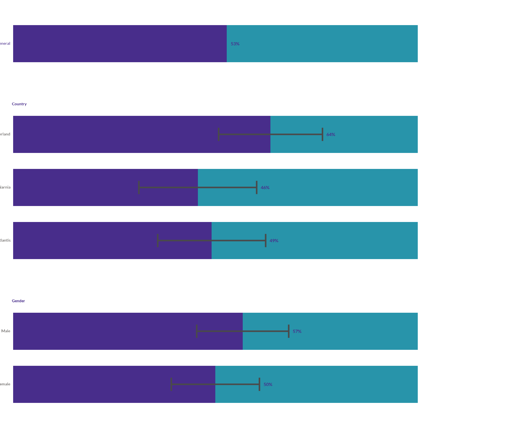

**Expected input structure** — one row per `levels` category, tagged
with the `grouping` (facet) it belongs to and its `target` value.
`target`, `national_value`, `ci_lower`, and `ci_upper` may be
proportions or percentages. To draw a confidence interval on each bar,
set `draw_ci = TRUE` and either supply per-category `sd` plus
`sample_size`, or pass precomputed `ci_lower` and `ci_upper` columns.
When `national_style = "bar"`, the national value is inserted as a
regular bar row and can receive its own `national_ci_lower` and
`national_ci_upper`. The second color represents the complement to 100%,
so a neutral gray keeps attention on the measured percentage and its
interval.

| group  | category | value | lower | upper |
|:-------|:---------|------:|------:|------:|
| Gender | Men      |  74.4 |  72.4 |  76.4 |
| Gender | Women    |  70.3 |  68.4 |  72.1 |
| Age    | 18-24    |  72.1 |  70.1 |  74.5 |
| Age    | 25-54    |  73.1 |  71.0 |  75.2 |
| Age    | 55+      |  73.0 |  70.8 |  75.2 |

Input data for wjp_groupbars(): target = value, grouping = group, levels
= category, lower/upper for confidence intervals {.table}

------------------------------------------------------------------------

## Quick Reference

| Chart | Function | Best For |
|----|----|----|
| Vertical Bars | [`wjp_bars()`](https://worldjusticeproject-org.github.io/WJPr/reference/wjp_bars.md) | Comparing values across categories |
| Horizontal Bars | `wjp_bars(direction = "horizontal")` | Long category names |
| Diverging Bars | [`wjp_divbars()`](https://worldjusticeproject-org.github.io/WJPr/reference/wjp_divbars.md) | Positive/negative comparisons |
| Dots | [`wjp_dots()`](https://worldjusticeproject-org.github.io/WJPr/reference/wjp_dots.md) | Multiple groups, multiple variables |
| Lines | [`wjp_lines()`](https://worldjusticeproject-org.github.io/WJPr/reference/wjp_lines.md) | Trends over time |
| Slope | [`wjp_slope()`](https://worldjusticeproject-org.github.io/WJPr/reference/wjp_slope.md) | Change between two time points |
| Dumbbells | [`wjp_dumbbells()`](https://worldjusticeproject-org.github.io/WJPr/reference/wjp_dumbbells.md) | Before/after comparisons |
| Lollipops | [`wjp_lollipops()`](https://worldjusticeproject-org.github.io/WJPr/reference/wjp_lollipops.md) | Minimalist bar alternative |
| Edgebars | [`wjp_edgebars()`](https://worldjusticeproject-org.github.io/WJPr/reference/wjp_edgebars.md) | Narrow spaces, long labels |
| Radar | [`wjp_radar()`](https://worldjusticeproject-org.github.io/WJPr/reference/wjp_radar.md) | Multi-dimensional group comparison |
| Rose | [`wjp_rose()`](https://worldjusticeproject-org.github.io/WJPr/reference/wjp_rose.md) | Multi-dimensional single unit |
| Gauge | [`wjp_gauge()`](https://worldjusticeproject-org.github.io/WJPr/reference/wjp_gauge.md) | Composition, progress |
| Grouped Bars | [`wjp_groupbars()`](https://worldjusticeproject-org.github.io/WJPr/reference/wjp_groupbars.md) | Compare a value across demographic groups |
